# Hoofdstuk 1: Wat is Medewerkerparticipatie?

In dit hoofdstuk maken we het concept medewerkerparticipatie concreet en praktisch toepasbaar. We kijken naar wat het precies inhoudt, hoe het verschilt van traditioneel overleg, en hoe het zich heeft ontwikkeld tot een krachtig organisatieprincipe.

## Een heldere definitie

Medewerkerparticipatie is het structureel betrekken van medewerkers bij besluitvorming en bedrijfsoperaties. Het gaat veel verder dan incidenteel overleg of het ophalen van vrijblijvende meningen. Bij echte participatie hebben medewerkers daadwerkelijk invloed op beslissingen en dragen ze medeverantwoordelijkheid voor de uitkomsten.

De drie kernkenmerken van effectieve medewerkerparticipatie zijn:

1. **Structurele inbedding** - Participatie is geen eenmalige actie maar een vast onderdeel van werkprocessen en besluitvormingscycli
2. **Gedeelde verantwoordelijkheid** - Medewerkers dragen niet alleen bij aan ideeën maar ook aan de implementatie en resultaten
3. **Transparante terugkoppeling** - Er is altijd duidelijke communicatie over wat er met input gebeurt en waarom bepaalde keuzes worden gemaakt

```mermaid
graph LR
    A[Informeren] -->|Eenrichtingsverkeer| B[Raadplegen]
    B -->|Meningen vragen| C[Adviseren]
    C -->|Invloed uitoefenen| D[Coproduceren]
    D -->|Samen beslissen| E[Meebeslissen]
    
    style A fill:#f9f9f9,stroke:#333,stroke-width:1px
    style B fill:#e6f2ff,stroke:#333,stroke-width:1px
    style C fill:#cce5ff,stroke:#333,stroke-width:1px
    style D fill:#99ccff,stroke:#333,stroke-width:1px
    style E fill:#66b3ff,stroke:#333,stroke-width:1px
```

*Figuur 1: Het participatiecontinuüm - van informeren naar meebeslissen*

## Participatie in de praktijk

Hoe ziet medewerkerparticipatie er concreet uit in organisaties? Twee voorbeelden maken dit duidelijk:

### Innovation Circles

Bij een toonaangevend bedrijf in de technologiesector worden maandelijks cross-functionele innovatiesessies georganiseerd. Hierin werken medewerkers uit verschillende afdelingen samen aan concrete verbeteringen. Wat deze aanpak bijzonder effectief maakt:

- Teams hebben beslissingsbevoegdheid over verbeteringen binnen hun werkgebied
- Er is een directe koppeling aan de bonusstructuur, waardoor participatie wordt beloond
- De resultaten zijn indrukwekkend: 40% productiviteitsstijging in de pilot-afdelingen

### Employee Decision Hub

Een luchtvaartmaatschappij heeft een digitaal platform ontwikkeld waar medewerkers direct kunnen bijdragen aan operationele beslissingen. Via dit real-time dashboard kunnen frontline medewerkers knelpunten signaleren en oplossingen voorstellen. De impact:

- 72% hogere implementatiesnelheid van verbeteringen
- Grotere betrokkenheid van medewerkers bij dagelijkse operaties
- Betere beslissingen door input van mensen die het dichtst bij de klant staan

De grootste uitdaging bleek de culturele weerstand bij middenmanagement, die moesten wennen aan deze nieuwe vorm van gedeelde besluitvorming.

## Participatie versus traditioneel overleg

Veel organisaties denken dat ze aan medewerkerparticipatie doen, terwijl ze in werkelijkheid blijven steken in traditioneel overleg. Het verschil is cruciaal:

| Aspect | Traditioneel overleg | Echte medewerkerparticipatie |
|--------|----------------------|------------------------------|
| **Frequentie** | Incidenteel, vaak bij problemen | Structureel ingebed in werkprocessen |
| **Impact** | Adviserend, management beslist | Beslissend, binnen afgesproken kaders |
| **Verantwoordelijkheid** | Blijft bij management | Gedeeld eigenaarschap |
| **Follow-up** | Vaak onduidelijk wat er met input gebeurt | Concrete actiepunten met eigenaren |
| **Voorbeeld** | Jaarlijks medewerkerstevredenheidsonderzoek | Wekelijkse verbeterideeën met implementatiebevoegdheid |

*Tabel 1: Verschillen tussen traditioneel overleg en echte participatie*

## Van hiërarchie naar participatie: een historische ontwikkeling

Medewerkerparticipatie is niet nieuw, maar heeft een duidelijke evolutie doorgemaakt. Deze ontwikkeling weerspiegelt bredere maatschappelijke en organisatorische veranderingen:

**Jaren '80: Hiërarchische structuren**  
Besluitvorming was gecentraliseerd bij het management. Medewerkers voerden uit wat van bovenaf werd bepaald. Communicatie was vooral top-down.

**Jaren '90: Kwaliteitskringen**  
De eerste vormen van gestructureerde participatie ontstonden met kwaliteitskringen en ISO-implementaties. Medewerkers kregen een stem in kwaliteitsverbetering, maar beperkt tot hun directe werkgebied.

**2000-2010: Zelfsturende teams**  
Organisaties experimenteerden met zelfsturende teams en lean management. Medewerkers kregen meer autonomie, maar vaak binnen strikte kaders.

**2010-2020: Agile revolutie**  
Agile werkwijzen zoals Scrum werden mainstream, met een sterke nadruk op zelfsturing, korte feedbackcycli en klantbetrokkenheid.

**2020-heden: Digitale participatieplatforms**  
Technologie maakt nieuwe vormen van participatie mogelijk. Digitale platforms faciliteren real-time feedback, ideeëngeneratie en besluitvorming op afstand.

Deze evolutie laat zien dat participatie steeds meer verweven raakt met de dagelijkse werkprocessen en steeds breder wordt toegepast in organisaties.

## Actuele trends in medewerkerparticipatie

De nieuwste ontwikkelingen in medewerkerparticipatie worden gekenmerkt door drie belangrijke trends:

1. **Co-creatie met externe stakeholders**  
   Participatie beperkt zich niet langer tot interne medewerkers. Klanten, leveranciers en andere externe stakeholders worden steeds vaker betrokken bij innovatie- en verbeterprocessen.

2. **Data-gedreven participatie**  
   Besluitvorming wordt ondersteund door data en analytics. Dit maakt participatie objectiever en meetbaarder, en helpt om de impact van participatie-initiatieven aan te tonen.

3. **Real-time feedbacksystemen**  
   Continue feedback vervangt periodieke evaluaties. Medewerkers kunnen op elk moment input geven, wat leidt tot snellere aanpassingen en verbeteringen.

## Aan de slag: bepaal je startpunt

> **Reflectievraag:**  
> "Hoe zou jij het huidige niveau van participatie in jouw organisatie beschrijven op een schaal van 1 (puur hiërarchisch) tot 5 (volledig participatief)? Welke concrete voorbeelden ondersteunen deze score?"

Om deze vraag goed te kunnen beantwoorden, is het nuttig om eerst een nulmeting te doen. Het zelfscan-werkblad helpt je om systematisch in kaart te brengen waar je organisatie nu staat op het gebied van medewerkerparticipatie.

### Praktische tip

Begin met het in kaart brengen van één afdeling of team als je de zelfscan voor het eerst gebruikt. Dit geeft je een concreet startpunt en maakt het makkelijker om later vergelijkingen te maken tussen verschillende delen van de organisatie.

[Download zelfscan-werkblad](/hoofdstukken/zelfscan-werkblad.md){ .md-button .md-button--primary }
