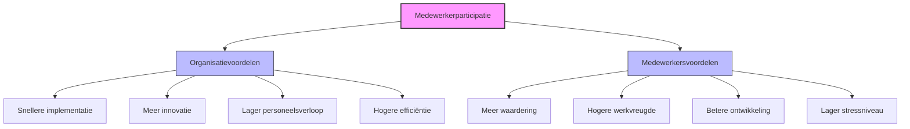

# Hoofdstuk 2: Waarom is Medewerkerparticipatie Belangrijk?

In dit hoofdstuk belichten we de concrete voordelen van medewerkerparticipatie, zowel voor organisaties als voor medewerkers zelf. We onderbouwen deze voordelen met onderzoek, praktijkvoorbeelden en wetenschappelijke inzichten.

*Figuur 1: De belangrijkste voordelen van medewerkerparticipatie*

## Voordelen voor de organisatie

### Snellere implementatie van beslissingen

Wanneer medewerkers betrokken worden bij besluitvorming, ontstaat een gevoel van eigenaarschap dat de implementatie aanzienlijk versnelt. Onderzoek van McKinsey toont aan dat beslissingen met substantiële medewerkersinput tot vier keer sneller worden geïmplementeerd dan top-down besluiten. 

Dit komt door twee factoren:
1. Er is minder weerstand omdat mensen zich mede-eigenaar voelen van de beslissing
2. De beslissingen sluiten beter aan bij de dagelijkse praktijk, waardoor ze makkelijker uitvoerbaar zijn

**Praktijkvoorbeeld:** Bij een grote zorginstelling daalde de implementatietijd van nieuwe werkprocessen van gemiddeld 6 maanden naar 6 weken nadat ze overstapten op een participatieve aanpak waarbij zorgmedewerkers vanaf het begin betrokken waren.

### Meer innovatie en creativiteit

Teams die structureel betrokken worden bij besluitvorming genereren aantoonbaar meer innovatieve ideeën. Onderzoek van Harvard Business Review laat zien dat participatieve teams gemiddeld 37% meer patenten genereren dan teams in traditionele structuren.

De verklaring hiervoor is tweeledig:
- Participatie benut de 'wisdom of crowds': diverse perspectieven leiden samen tot betere oplossingen dan zelfs de slimste individuen alleen kunnen bedenken
- Participatie creëert een veiligere omgeving om risico's te nemen en van fouten te leren - essentiële voorwaarden voor innovatie

### Lager personeelsverloop

Organisaties die medewerkers structureel betrekken bij besluitvorming ervaren gemiddeld 21% lager personeelsverloop, volgens Gallup-onderzoek. Dit vertaalt zich direct in:
- Lagere wervings- en inwerkkosten
- Behoud van waardevolle kennis en ervaring
- Sterkere teams met meer continuïteit

De onderliggende dynamiek is eenvoudig: mensen verlaten minder snel een omgeving waarin ze zich gehoord en gewaardeerd voelen, en waar ze invloed kunnen uitoefenen op hun werkomstandigheden.

### Hogere operationele efficiëntie

Wanneer de mensen die dagelijks met processen werken, kunnen bijdragen aan de optimalisatie ervan, leidt dit tot aantoonbare efficiëntieverbeteringen. Frontline medewerkers zien vaak kansen voor verbetering die voor managers onzichtbaar blijven.

**Voor HR-professionals:** Betrek medewerkers bij het herontwerpen van HR-processen zoals beoordelingscycli of onboardingtrajecten. Hun praktijkervaring leidt vaak tot eenvoudigere, effectievere processen.

## Voordelen voor medewerkers

### Meer waardering en erkenning

Uit grootschalig onderzoek blijkt dat 68% van de medewerkers in participatieve organisaties zich aanzienlijk meer gewaardeerd voelt. Dit gevoel van waardering vertaalt zich in:
- Diepere verbinding met de organisatie
- Sterkere toewijding aan het werk
- Hogere motivatie en inzet

### Hogere werkvreugde en zingeving

Participatie verhoogt de werkvreugde aanzienlijk. 45% van de medewerkers in participatieve omgevingen rapporteert hogere werktevredenheid, onafhankelijk van functie of niveau. Deze toegenomen voldoening komt voort uit:
- Een diepere verbinding met het werk en de organisatie
- Een sterker gevoel van autonomie en controle
- Het besef dat de eigen bijdrage ertoe doet

In een tijd waarin werk-privébalans en betekenisvol werk steeds belangrijker worden, is dit een niet te onderschatten voordeel.

### Betere loopbaanontwikkeling

Medewerkers in participatieve organisaties stromen twee keer zo vaak door naar andere functies binnen dezelfde organisatie. Deze verhoogde interne mobiliteit heeft meerdere oorzaken:
- Ze worden zichtbaarder door hun actieve bijdrage
- Ze ontwikkelen bredere vaardigheden door cross-functionele samenwerking
- Ze bouwen sterkere netwerken binnen de organisatie

**Tip voor leidinggevenden:** Maak participatie onderdeel van talentontwikkeling. Laat medewerkers deelnemen aan projecten of werkgroepen buiten hun directe functie om hun vaardigheden te verbreden en zichtbaarheid te vergroten.

### Lager stressniveau en meer welzijn

Participatie vervult drie fundamentele menselijke behoeften:
1. **Autonomie** - controle over het eigen werk
2. **Competentie** - het gevoel bekwaam te zijn
3. **Verbondenheid** - betekenisvolle relaties met anderen

Deze drie elementen vormen volgens de zelfdeterminatietheorie de basis voor intrinsieke motivatie en welzijn. Het is dan ook niet verwonderlijk dat participatieve werkplekken geassocieerd worden met:
- Lagere stressniveaus
- Minder burnout
- Hogere algehele levenstevredenheid

## Praktijkvoorbeeld: Participatie bij TechBedrijf X

### De uitdaging

TechBedrijf X, een middelgrote softwareontwikkelaar in de financiële sector, kampte met een herkenbaar probleem: een traag innovatietempo ondanks getalenteerde ontwikkelaars. De traditionele top-down productontwikkeling resulteerde in:
- Lange ontwikkelcycli
- Beperkte creativiteit
- Een groeiende kloof tussen management en ontwikkelteams

### De participatieve aanpak

Het keerpunt kwam toen de nieuwe CTO, zelf afkomstig uit de ontwikkelafdeling, een participatieve benadering introduceerde gebaseerd op drie pijlers:

1. **Wekelijkse cross-functionele hackathons**
   - Elke vrijdag werkten teams uit ontwikkeling, design, marketing, klantenservice en finance samen
   - Teams waren volledig zelfsturend, zonder managementinterventie
   - Deelname was niet vrijblijvend maar structureel ingebed in het werkproces

2. **Digitaal ideeënplatform met realtime stemming**
   - Alle medewerkers konden ideeën indienen die door collega's werden beoordeeld
   - Volledige transparantie over welke ideeën werden aangedragen en geselecteerd
   - Niet alleen het aantal stemmen telde, maar ook de diversiteit van ondersteuning

3. **20% van het ontwikkelbudget direct naar medewerkersinitiatieven**
   - Teams konden dit budget zelfstandig toewijzen zonder goedkeuring van hogerhand
   - Enige voorwaarde: achteraf aantonen welke lessen waren geleerd
   - Succes én falen werden gewaardeerd als leermomenten

### De resultaten

De impact na zes maanden was indrukwekkend:
- 15 nieuwe productfeatures gelanceerd (>50% uit hackathons of ideeënplatform)
- 40% kortere time-to-market voor nieuwe functionaliteiten
- 35 punten stijging in medewerkerstevredenheid (op schaal van 100)
- Daling personeelsverloop van 24% naar 9% op jaarbasis

### Succesfactoren

Wat deze case bijzonder leerzaam maakt:
- Participatie werd geformaliseerd zonder het te bureaucratiseren
- Duidelijke structuren maakten participatie niet vrijblijvend
- Autonomie binnen deze structuren behield de intrinsieke motivatie
- De combinatie leidde tot een fundamentele cultuurverandering

## Wetenschappelijke onderbouwing

De voordelen van medewerkerparticipatie worden onderbouwd door diverse wetenschappelijke disciplines:

### Organisatiepsychologie
Participatie versterkt 'organizational citizenship behavior' - de bereidheid van medewerkers om bijdragen te leveren die verder gaan dan hun functieomschrijving. Dit verklaart waarom participatieve organisaties veerkrachtiger zijn.

### Neuropsychologie
Betrokkenheid bij besluitvorming activeert beloningscentra in de hersenen, vergelijkbaar met andere positieve ervaringen. Dit versterkt de emotionele binding met de organisatie en stimuleert creatief denken.

### Sociologie
Participatie bouwt sociaal kapitaal op - het netwerk van relaties en gedeeld vertrouwen dat collectieve actie mogelijk maakt. Dit verlaagt drempels voor samenwerking en bevordert kennisdeling.

### Managementwetenschappen
In een VUCA-wereld (Volatile, Uncertain, Complex, Ambiguous) zijn hiërarchische besluitvormingsprocessen vaak te traag. Participatieve benaderingen benutten gedistribueerde intelligentie, waardoor organisaties sneller kunnen reageren op veranderingen.

## Participatie als concurrentievoordeel

In de huidige kenniseconomie wordt participatie steeds meer een differentiërende factor tussen organisaties. Dit concurrentievoordeel manifesteert zich op drie fronten:

### 1. Aantrekken van talent
Vooral jongere generaties selecteren werkgevers op basis van participatiemogelijkheden en autonomie. Een sterk participatief profiel wordt daarmee een belangrijk element in employer branding.

### 2. Snelheid van innovatie
Participatie stelt organisaties in staat om sneller te experimenteren, te leren en zich aan te passen. De directe verbinding tussen medewerkers en klanten zorgt voor een continue stroom van marktinzichten.

### 3. Unieke organisatiecultuur
De cultuur die ontstaat door langdurige participatie - gekenmerkt door vertrouwen, openheid en gezamenlijke verantwoordelijkheid - is vrijwel onmogelijk te kopiëren door concurrenten.

**Tip voor HR-professionals:** Maak participatie onderdeel van je employer branding strategie. Concrete voorbeelden van hoe medewerkers invloed hebben op besluitvorming zijn krachtige verhalen in wervingscampagnes.

## Aan de slag: bepaal de waarde voor jouw organisatie

> **Reflectievraag:**  
> "Welke drie concrete voordelen zou participatie jouw team kunnen opleveren binnen 6 maanden? Hoe zou je deze meten? En welke bestaande processen zouden het meest kunnen profiteren van een participatieve benadering?"

### Praktische tip

Begin met het identificeren van één proces dat momenteel niet optimaal verloopt en waar medewerkers waardevolle inzichten kunnen bieden. Dit kan een HR-proces zijn zoals de beoordelingscyclus, een operationeel proces, of een besluitvormingsproces. Organiseer een gerichte sessie waarin medewerkers niet alleen problemen kunnen benoemen, maar ook oplossingen kunnen aandragen en prioriteren.

[Download reflectie-werkblad](/hoofdstukken/reflectie-werkblad.md){ .md-button .md-button--primary }

## Verdiepende bronnen

- Laloux, F. (2014). *Reinventing Organizations*
- Pink, D. H. (2011). *Drive: The Surprising Truth About What Motivates Us*
- Edmondson, A. (2018). *The Fearless Organization*
- Marquet, L. D. (2015). *Turn the Ship Around!: A True Story of Turning Followers into Leaders*
- Sinek, S. (2014). *Leaders Eat Last: Why Some Teams Pull Together and Others Don't*
