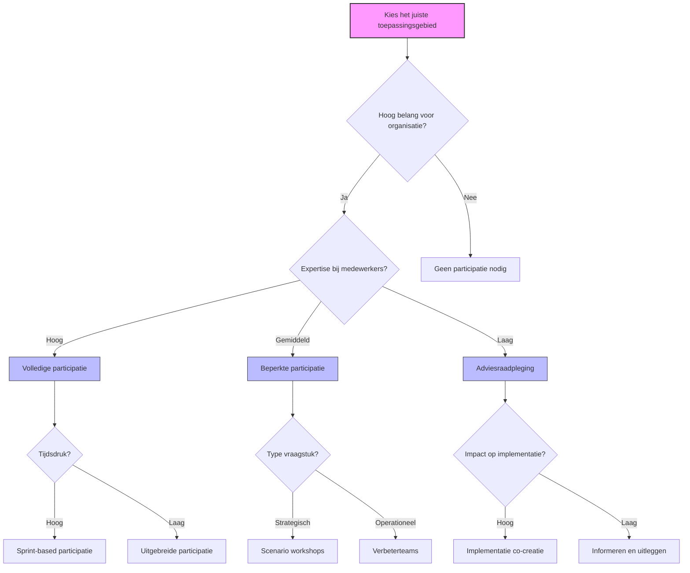

# Hoofdstuk 3: Waar Pas Je Medewerkerparticipatie Toe?

In dit hoofdstuk ontdek je de meest effectieve toepassingsgebieden voor medewerkerparticipatie en leer je hoe je de juiste participatievorm kiest voor jouw specifieke situatie. We kijken naar concrete voorbeelden uit verschillende sectoren en bieden praktische handvatten voor HR-professionals en leidinggevenden.

## De juiste match tussen vraagstuk en participatievorm

De sleutel tot succesvolle medewerkerparticipatie ligt niet in het overal toepassen ervan, maar in het strategisch kiezen van de juiste toepassingsgebieden. Onderzoek van McKinsey toont aan dat organisaties die participatie gericht inzetten op zorgvuldig geselecteerde domeinen, 3,2 keer meer waarde genereren dan organisaties die participatie willekeurig implementeren.

*Figuur 1: Beslisboom voor het kiezen van de juiste participatievorm*

## Vier strategische toepassingsgebieden

### 1. Beleidsvorming en strategie

Hoewel beleidsvorming traditioneel het domein is van senior management, kunnen participatieve benaderingen de kwaliteit, acceptatie en implementatie van beleid significant verbeteren. Onderzoek van de Erasmus Universiteit toont aan dat beleid met substantiële medewerkersinput 2,7 keer sneller wordt geïmplementeerd en 41% minder weerstand ontmoet dan top-down geformuleerd beleid.

#### Praktijkvoorbeelden:

**Duurzaamheidsstrategie ontwikkelen**  
Een groot concern betrok meer dan 500 medewerkers uit alle niveaus bij het ontwikkelen van hun duurzaamheidsplan via workshops, digitale platforms en cross-functionele teams. Resultaat: 37% snellere implementatie dan bij eerdere top-down strategieën en 84% van de medewerkers rapporteerde een sterk gevoel van eigenaarschap.

**Kantooromgeving herinrichten**  
Een bank betrok medewerkers intensief bij het herontwerp van hun hoofdkantoor via virtuele tours, prototyping van werkplekken en real-time feedbacksystemen. Resultaat: 28% hogere tevredenheid met de werkomgeving en 23% meer cross-functionele samenwerking.

**Nieuwe IT-systemen selecteren**  
Een bank implementeerde een "User Voice Program" voor de selectie van een nieuw CRM-systeem. Frontline medewerkers definieerden requirements, evalueerden leveranciers en testten prototypes. Resultaat: 42% hogere gebruikerstevredenheid en 67% snellere adoptie. Bijkomend voordeel: betrokken medewerkers werden natuurlijke ambassadeurs tijdens de uitrol, wat implementatiekosten met 31% reduceerde.

**Tip voor HR-professionals:** Begin met een beleidsterrein waar medewerkers duidelijk toegevoegde waarde kunnen bieden, zoals het ontwikkelen van een nieuw onboardingprogramma of het herzien van het thuiswerkbeleid. Zorg voor een duidelijk kader waarbinnen medewerkers kunnen bijdragen.

### 2. Operationele optimalisatie

Bij het verbeteren van dagelijkse werkprocessen is medewerkerparticipatie bijzonder effectief. Frontline medewerkers zien inefficiënties, knelpunten en verbetermogelijkheden die voor managers vaak onzichtbaar blijven.

#### Praktijkvoorbeelden:

**Procesverbetering in productie**  
Het "Kaizen" systeem van Toyota is een schoolvoorbeeld van effectieve participatie. Productiemedewerkers worden niet alleen aangemoedigd maar verwacht om continu verbetervoorstellen te doen. In de Nederlandse Toyota-fabriek leidt dit tot gemiddeld 14 geïmplementeerde verbeteringen per medewerker per jaar. Resultaat: 37% productiviteitsstijging over vijf jaar, 42% minder defecten en 28% lager energieverbruik. Cruciaal: 94% van alle voorstellen wordt daadwerkelijk geïmplementeerd.

**Dienstverleningsinnovatie**  
Een bank stelt klantenservicemedewerkers in staat om direct bij te dragen aan service-innovatie via een digitaal platform. Ideeën worden door collega's beoordeeld en door cross-functionele teams ontwikkeld. Resultaat: 27 geïmplementeerde service-innovaties in één jaar, waaronder een vereenvoudigd hypotheekvernieuwingsproces dat klanttevredenheid met 31% verhoogde en verwerkingstijd met 47% verminderde.

**Kwaliteitsborging verbeteren**  
Een elektronicabedrijf implementeerde "Quality Circles" waarin productiemedewerkers, kwaliteitsspecialisten en engineers samenwerken aan kwaliteitsprocedures. Resultaat: 53% minder kwaliteitsincidenten en 29% lagere compliance-kosten. Opvallend: 68% van de geïdentificeerde kwaliteitsrisico's was niet zichtbaar in formele risicoanalyses maar kwam voort uit praktijkervaring.

**Tip voor leidinggevenden:** Organiseer maandelijkse verbeteringssessies waarin teams één specifiek proces of knelpunt analyseren en oplossingen voorstellen. Geef teams een klein budget om verbeteringen zelf te implementeren en vier successen openlijk.

**Rooster beïnvloeding**  
Een zorginstelling implementeerde een systeem waarbij medewerkers zelf hun roosters konden samenstellen, rekening houdend met hun persoonlijke voorkeuren en de behoeften van de afdeling. Dit zelfroosteren leidde tot een hogere tevredenheid onder medewerkers, een betere work-life balance en een efficiëntere personeelsplanning.

### 3. Persoonlijke ontwikkeling

Medewerkers hebben vaak het beste inzicht in hun eigen ontwikkelbehoeften, leerstijlen en carrièreaspiraties. Participatieve benaderingen in dit domein leiden tot meer eigenaarschap over de eigen ontwikkeling en betere afstemming tussen persoonlijke en organisatiedoelen.

#### Praktijkvoorbeelden:

**Individuele ontwikkelplannen**  
Een grote bank gebruikt een co-creatief proces waarin medewerkers en leidinggevenden samen ontwikkelplannen vormgeven. Medewerkers identificeren zelf hun ontwikkeldoelen, terwijl managers coachen en resources bieden. Resultaat: 47% hogere voltooiingsratio's van ontwikkelactiviteiten en 36% sterkere correlatie tussen individuele ontwikkeling en business impact.

**Teamrolverdeling**  
Een muziekstreamingdienst geeft teams substantiële autonomie in hoe zij rollen verdelen. Teams houden regelmatig "Role Refinement" sessies waarin zij de rolverdeling aanpassen op basis van veranderende behoeften en persoonlijke ontwikkeling. Resultaat: 34% hogere teameffectiviteit, 41% meer cross-functionele vaardigheidsontwikkeling en 28% minder burnout.

**Loopbaangesprekken**  
Een energiebedrijf transformeerde loopbaanplanning van een jaarlijks beoordelingsmoment naar een doorlopende dialoog. Medewerkers bereiden gesprekken voor met self-assessment tools en peer feedback, en komen met concrete voorstellen voor hun volgende stappen. Resultaat: 43% hogere interne mobiliteit en 37% betere talentbehoud.

**Tip voor HR-professionals:** Ontwikkel een toolkit voor leidinggevenden met gesprekshandleidingen, reflectievragen en oefeningen die zij kunnen gebruiken om participatieve ontwikkelgesprekken te voeren. Train leidinggevenden in coachingsvaardigheden die participatie ondersteunen.

### 4. Reorganisaties en structuurveranderingen

Reorganisaties hebben verstrekkende impact op medewerkers en organisatieprestaties. Participatie kan de kwaliteit van besluitvorming verbeteren en draagvlak voor verandering vergroten.

#### Praktijkvoorbeeld:

Een overheidsinstelling ontwikkelde een toetsingskader waarmee reorganisatievoorstellen worden beoordeeld op medewerkerparticipatie. Het kader evalueert of medewerkers betrokken zijn bij het identificeren van problemen, het ontwikkelen van oplossingen en het uitwerken van implementatieplannen. Resultaat: Voorstellen met hoge participatiescores worden significant sneller goedgekeurd en kennen 47% minder implementatieproblemen.

#### Vijf principes voor participatie bij reorganisaties:

1. **Vroege betrokkenheid:** Betrek medewerkers voordat plannen definitief zijn
2. **Transparantie over kaders:** Wees duidelijk over wat wel en niet beïnvloedbaar is
3. **Diverse perspectieven:** Zorg dat verschillende functies, niveaus en afdelingen vertegenwoordigd zijn
4. **Iteratieve aanpak:** Test conceptplannen bij bredere groepen en verfijn op basis van feedback
5. **Implementatieparticipatie:** Betrek medewerkers bij het uitwerken van concrete implementatiestappen

Onderzoek toont aan dat reorganisaties waarbij deze principes worden toegepast 38% hogere slagingskansen hebben en 42% minder productiviteitsverlies tijdens de transitie ervaren.

**Tip voor HR-professionals:** Ontwikkel een participatieplan als standaard onderdeel van elk reorganisatietraject. Definieer duidelijk welke beslissingen participatief worden genomen en welke niet, en communiceer dit transparant naar alle betrokkenen.

## Overzicht toepassingsgebieden

| Toepassingsgebied | Wanneer participatie inzetten | Geschikte participatievormen | Typische resultaten |
|-------------------|------------------------------|------------------------------|-------------------|
| **Beleidsvorming** | Bij complexe, cross-functionele vraagstukken met grote impact op medewerkers | Scenario workshops, co-creatie sessies, digitale consultatie | Snellere implementatie, minder weerstand, betere aansluiting bij praktijk |
| **Operationele optimalisatie** | Bij processen waar frontline medewerkers directe ervaring mee hebben | Verbeterteams, ideeënplatforms, kwaliteitscirkels | Hogere efficiëntie, minder fouten, meer innovatie |
| **Persoonlijke ontwikkeling** | Bij ontwikkeltrajecten en loopbaanplanning | Co-creatie van ontwikkelplannen, peer feedback, zelfsturende teams | Meer eigenaarschap, hogere voltooiingsratio's, betere talentbehoud |
| **Reorganisaties** | Bij structuurveranderingen met grote impact op werkwijzen | Werkgroepen, feedbackrondes, implementatieteams | Minder weerstand, betere plannen, snellere implementatie |

## Algemene principes voor effectieve toepassingen

Ongeacht het specifieke toepassingsgebied, zijn er vier principes die de effectiviteit van medewerkerparticipatie bepalen:

### 1. Afstemming op organisatiedoelen

Effectieve participatie is altijd gekoppeld aan strategische organisatiedoelen. Dit zorgt voor focus en relevantie, en voorkomt dat participatie wordt gezien als een losstaande activiteit.

**In de praktijk:** Formuleer voor elk participatie-initiatief een duidelijke doelstelling die direct gekoppeld is aan organisatieprioriteiten. Communiceer deze koppeling expliciet naar alle betrokkenen.

### 2. Balans tussen structuur en flexibiliteit

Succesvolle participatie combineert duidelijke structuren met ruimte voor spontane bijdragen. Te veel structuur belemmert creativiteit, terwijl te weinig structuur leidt tot vrijblijvendheid.

**In de praktijk:** Ontwikkel een participatie-framework met duidelijke processen en rollen, maar bouw bewust ruimte in voor experimenteren. Combineer formele mechanismen (zoals werkgroepen) met informele kanalen (zoals ideeënplatforms).

### 3. Inclusiviteit en diversiteit

De waarde van participatie wordt versterkt door diversiteit in perspectieven, ervaringen en expertise. Inclusieve participatie zorgt dat verschillende stemmen worden gehoord.

**In de praktijk:** Zorg voor representatie van verschillende functies, niveaus en demografische groepen. Creëer veilige omgevingen waar alle stemmen gehoord kunnen worden, en pas facilitatiemethoden toe die dominantie door enkele stemmen voorkomen.

### 4. Transparantie over invloed

Duidelijkheid over de mate van invloed die medewerkers hebben is cruciaal voor het managen van verwachtingen en het bouwen van vertrouwen.

**In de praktijk:** Communiceer expliciet welke beslissingsbevoegdheid medewerkers hebben in elk participatieproces (adviseren, co-creëren, of zelfstandig beslissen). Geef feedback over wat er met suggesties is gedaan en waarom bepaalde ideeën wel of niet zijn geïmplementeerd.

## Participatie in verschillende organisatiecontexten

### Grote organisaties

Grote organisaties worstelen vaak met bureaucratie en silovorming. Effectieve participatie vereist hier formele structuren die de organisatiecomplexiteit overbruggen.

**Sleutelelementen:**
- Expliciete autorisatie door senior leiderschap
- Cross-functionele structuren die silovorming doorbreken
- Schaalbaarheid ondanks grote aantallen medewerkers
- Integratie met formele besluitvormingsprocessen

**Tip voor HR in grote organisaties:** Ontwikkel een formeel participatie-framework dat aansluit bij bestaande governance-structuren. Zorg voor duidelijke mandatering vanuit de top en train een netwerk van facilitators die participatieprocessen kunnen begeleiden.

### MKB en startups

Kleinere organisaties hebben vaak minder formele structuren, wat informele participatie kan faciliteren, maar ook kan leiden tot ad-hoc benaderingen zonder systematische impact.

**Sleutelelementen:**
- Lichtgewicht processen die passen bij beperkte resources
- Behoud van snelheid in besluitvorming
- Participatiestructuren die meegroeien met de organisatie
- Participatie als kernwaarde in plaats van formeel proces

**Tip voor HR in kleinere organisaties:** Focus op het creëren van participatieve routines die weinig overhead vereisen, zoals wekelijkse verbeteringssessies of maandelijkse strategische dialogen. Documenteer successen om een business case op te bouwen voor meer structurele participatie naarmate de organisatie groeit.

## Aan de slag: kies je eerste toepassingsgebied

> **Reflectievraag:**  
> "Welke actuele uitdaging in jouw team zou direct baat hebben bij meer participatie? Welke vorm zou hierbij passen?"

Deze vraag nodigt uit tot concrete toepassing van de concepten uit dit hoofdstuk. Door te focussen op een actuele uitdaging, maak je participatie direct relevant. Onderzoek toont aan dat het koppelen van nieuwe concepten aan bestaande uitdagingen de kans op daadwerkelijke implementatie met 68% verhoogt.

### Praktische tip

Begin met een klein, afgebakend toepassingsgebied waar je snel resultaat kunt boeken. Succesvolle eerste ervaringen creëren momentum voor bredere toepassing. Kies bij voorkeur een gebied waar:
1. Medewerkers duidelijk relevante expertise hebben
2. De uitdaging belangrijk genoeg is om aandacht te rechtvaardigen
3. Er ruimte is voor betekenisvolle input
4. Resultaten relatief snel zichtbaar kunnen worden

[Download toepassingsmatrix](/hoofdstukken/toepassingsmatrix.md){ .md-button .md-button--primary }

Zelfsturende teams vertegenwoordigen het summum van medewerkerparticipatie. In deze teams zijn medewerkers gezamenlijk verantwoordelijk voor de planning, uitvoering en evaluatie van hun werk. Voor meer informatie over zelfsturende teams, verwijzen we je naar ons e-book over dit onderwerp (nog te maken).
