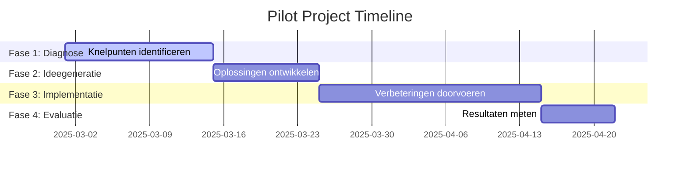

# Hoofdstuk 4: Hoe Start Je met Medewerkerparticipatie?

In dit hoofdstuk ontdek je hoe je concreet aan de slag gaat met medewerkerparticipatie in jouw organisatie. We bieden een praktische routekaart met stapsgewijze aanpak, voorbeelden uit de praktijk en direct toepasbare tools.

## De eerste stappen zetten

Medewerkerparticipatie implementeren is vergelijkbaar met het aanleggen van een tuin. Je kunt niet simpelweg zaadjes strooien en verwachten dat er een bloeiende tuin ontstaat. Er is voorbereiding van de grond nodig, zorgvuldige selectie van wat je wilt planten, regelmatig onderhoud, en geduld om de resultaten te zien groeien.

Onderzoek toont aan dat 78% van de mislukte participatie-initiatieven struikelt over onvoldoende voorbereiding en een gebrek aan duidelijke implementatiestrategie. Een doordachte, gefaseerde aanpak is daarom essentieel.

```mermaid
graph LR
    A[1. Cultuurdiagnose] --> B[2. Pilotselectie]
    B --> C[3. Kaderontwerp]
    C --> D[4. Werkgroep formeren]
    D --> E[5. Launch toolkit]
    E --> F[6. Evaluatiemechanisme]
    
    style A fill:#f9f,stroke:#333,stroke-width:2px
    style B fill:#bbf,stroke:#333,stroke-width:1px
    style C fill:#bbf,stroke:#333,stroke-width:1px
    style D fill:#bbf,stroke:#333,stroke-width:1px
    style E fill:#bbf,stroke:#333,stroke-width:1px
    style F fill:#bbf,stroke:#333,stroke-width:1px
```

*Figuur 1: De zes stappen voor het implementeren van medewerkerparticipatie*

## Stap 1: Cultuurdiagnose - Ken je startpunt

Voordat je begint met het implementeren van participatieve praktijken, is het essentieel om de huidige staat van je organisatiecultuur te begrijpen. Een grondige diagnose omvat drie complementaire benaderingen:

### Bestaande data analyseren

Begin met het verzamelen en analyseren van bestaande data uit:
- Medewerkerstevredenheidsonderzoeken
- Exit-interviews
- Interne surveys

Let specifiek op indicatoren die betrekking hebben op:
- Autonomie
- Betrokkenheid bij besluitvorming
- Vertrouwen in het management

**Praktijkvoorbeeld:** Een elektronicafabrikant ontdekte dat afdelingen met de laagste scores op "vertrouwen in besluitvorming" ook het hoogste personeelsverloop hadden. Dit bood een duidelijk aanknopingspunt voor gerichte participatie-interventies.

**Praktijkvoorbeeld:** In lijn met de "Great Place to Work" aanpak, start een softwarebedrijf haar participatietraject met een Trust Index meting. Deze index meet de mate van vertrouwen, respect, eerlijkheid, trots en kameraadschap binnen de organisatie. Lage scores op onderdelen als "Gehoord worden" en "Betrokkenheid bij besluitvorming" vormen een startpunt voor gerichte participatie-initiatieven.

### Gerichte quick scan uitvoeren

Vul bestaande data aan met een gerichte quick scan die specifiek focust op participatie-aspecten. Deze scan moet:
- Anoniem zijn om eerlijke antwoorden te garanderen
- Kort zijn (max. 5 minuten invultijd) om hoge respons te krijgen
- Specifieke vragen bevatten over participatie-ervaring

**Voorbeeldvragen:**
- "In welke mate voel je dat je ideeën serieus worden genomen?"
- "Hoe vaak word je betrokken bij beslissingen die impact hebben op je werk?"
- "Hoe transparant is de communicatie over besluitvorming in jouw team?"

### Benchmarking toepassen

Plaats je resultaten in context door ze te vergelijken met benchmarks uit je industrie. Dit helpt om te bepalen of bepaalde uitdagingen:
- Organisatie-specifiek zijn
- Breder voorkomen in de sector

**Tip voor HR-professionals:** Gebruik de zelfscan uit dit e-book als startpunt voor je diagnose. Laat deze invullen door een representatieve groep medewerkers en bespreek de resultaten met het managementteam om draagvlak te creëren voor vervolgstappen.

## Stap 2: Pilotselectie - Kies een kansrijk startpunt

Na de diagnose is het tijd om een geschikte pilot te selecteren. Een goed gekozen pilot maximaliseert de kans op vroeg succes, wat cruciaal is voor het opbouwen van momentum en draagvlak. Organisaties die beginnen met zorgvuldig geselecteerde pilots slagen 3,4 keer vaker in hun bredere participatie-implementatie.

### Criteria voor succesvolle pilots

#### Tijdsbegrensd (max 3 maanden)
Een korte tijdshorizon zorgt voor focus en urgentie, en maakt snelle leercycli mogelijk.

**Praktijkvoorbeeld:** Een Nederlandse bank introduceerde "Agile Squads" die begonnen als 12-weken pilots. Dit was kort genoeg om engagement hoog te houden maar lang genoeg om betekenisvolle resultaten te boeken.

#### Meetbare doelstellingen
Definieer vooraf concrete, meetbare doelstellingen die direct gekoppeld zijn aan bedrijfsresultaten, zoals:
- Operationele meetwaarden (doorlooptijdverkorting)
- Financiële indicatoren (kostenreductie)
- Medewerkergerelateerde meetwaarden (betrokkenheidsscores)

**Praktijkvoorbeeld:** Een supermarktketen's pilot voor winkeloptimalisatie had als concrete doelstelling een 15% reductie in out-of-stock situaties, wat een duidelijk meetpunt creëerde.

#### Cross-functionele samenstelling
Selecteer een pilot die van nature samenwerking tussen verschillende functies of afdelingen vereist. Dit:
- Doorbreekt silo's
- Demonstreert direct de waarde van diverse perspectieven
- Creëert bredere betrokkenheid in de organisatie

**Praktijkvoorbeeld:** Een energiebedrijf vormde "Transitieteams" die bewust technische, commerciële en duurzaamheidsexpertise combineerden. Dit leidde tot oplossingen die geen van de individuele disciplines alleen had kunnen bedenken.

**Tip voor leidinggevenden:** Kies een pilot die aansluit bij een actuele uitdaging of kans in de organisatie. Zo wordt participatie direct relevant en waardevol, in plaats van een losstaand "nice-to-have" initiatief.

## Stap 3: Kaderontwerp - Schep duidelijkheid

Een duidelijk kader is essentieel om participatie te structureren zonder het te bureaucratiseren. Het biedt helderheid over wat participatie wel en niet inhoudt, en voorkomt daarmee zowel schijnparticipatie als eindeloze discussies zonder conclusie.

### Elementen van een effectief participatieprotocol

#### Beslissingsmatrix
Specificeer welke beslissingen:
- Volledig participatief zijn (bindend)
- Adviserend zijn
- Buiten de scope van participatie vallen

Deze transparantie voorkomt teleurstelling en cynisme.

**Praktijkvoorbeeld:** Een coöperatieve bank gebruikt een visuele matrix die per beslissingstype aangeeft of medewerkers worden geïnformeerd, geconsulteerd, meebeslissen of zelfstandig beslissen.

#### Rolverdeling en verantwoordelijkheden
Definieer duidelijke rollen binnen het participatieproces:
- Wie faciliteert sessies?
- Wie documenteert uitkomsten?
- Wie bewaakt de implementatie van besluiten?

**Praktijkvoorbeeld:** Een chemieconcern werkt met roterende rollen waarbij teamleden afwisselend facilitator, notulist en implementatie-champion zijn. Dit verdeelt eigenaarschap en ontwikkelt verschillende vaardigheden.

#### Communicatiekanalen en frequentie
Leg vast hoe en wanneer communicatie plaatsvindt:
- Kanalen voor participatie zelf (wekelijkse stand-ups, digitale platforms)
- Communicatie over voortgang en resultaten
- Feedbackmechanismen

**Praktijkvoorbeeld:** Een brouwerij heeft een "Better Decisions" framework dat per participatietype het optimale communicatiekanaal en de ideale frequentie specificeert.

**Tip voor HR-professionals:** Ontwikkel een eenvoudige, visuele beslissingsmatrix die leidinggevenden kunnen gebruiken om te bepalen welke beslissingen zich lenen voor welke vorm van participatie. Dit voorkomt zowel over- als onderconsultatie.

## Stap 4: Werkgroep formeren - Creëer ambassadeurs

Een cruciale succesfactor bij het implementeren van medewerkerparticipatie is het samenstellen van een effectieve werkgroep. Deze groep fungeert als katalysator en ambassadeur voor het participatieproces binnen de organisatie.

### Kenmerken van een effectieve werkgroep

#### Representatieve afvaardiging
Zorg voor een werkgroep die een afspiegeling vormt van de afdeling of organisatie:
- Diversiteit in functieniveaus
- Verschillende afdelingen
- Variatie in anciënniteit
- Diverse perspectieven

**Praktijkvoorbeeld:** Een zorginstelling zorgde ervoor dat hun participatiewerkgroep bestond uit zowel zorgprofessionals, administratief personeel, als teamleiders. Dit leidde tot een breder draagvlak voor de initiatieven.

#### Vrijwillige deelname
Dwing niemand om deel te nemen aan de werkgroep:
- Gedwongen participatie ondermijnt het hele concept
- Vrijwillige deelname zorgt voor intrinsieke motivatie
- Open sollicitatie creëert eigenaarschap

**Praktijkvoorbeeld:** Een IT-dienstverlener stelde de werkgroep samen op basis van open sollicitaties, waarbij medewerkers hun motivatie konden toelichten. Dit resulteerde in een groep intrinsiek gemotiveerde ambassadeurs.

#### Investering in groepsvorming
Besteed bewust aandacht aan het creëren van een hecht team:
- Organiseer kennismakingsactiviteiten
- Definieer gezamenlijke waarden en werkafspraken
- Creëer veiligheid om open te communiceren

**Praktijkvoorbeeld:** Een productiebedrijf startte hun participatietraject met een volledige dag teambuilding voor de werkgroep. Dit resulteerde in sterke onderlinge verbindingen die cruciaal bleken tijdens latere uitdagingen.

#### Sterke relatie met management
De werkgroep moet effectief kunnen samenwerken met leidinggevenden:
- Organiseer gezamenlijke sessies
- Stem verwachtingen af
- Verduidelijk rollen
- Ontwikkel een gezamenlijke visie

**Praktijkvoorbeeld:** Een retailketen organiseerde maandelijkse dialoogsessies tussen de participatiewerkgroep en het managementteam. Dit bevorderde wederzijds begrip en vertrouwen.

**Tip voor leidinggevenden:** Geef de werkgroep een duidelijk mandaat en zichtbare steun. Wees aanwezig bij belangrijke momenten en toon oprechte interesse in hun werk. Dit signaleert naar de hele organisatie dat participatie serieus wordt genomen.

## Stap 5: Launch toolkit - Maak een professionele start

Een professionele, goed voorbereide lancering zet de toon voor het hele participatietraject. Het signaleert dat participatie serieus wordt genomen en niet slechts een modegril is.

### Essentiële elementen van een launch toolkit

#### Kickoff-presentatie template
Een gestandaardiseerde presentatie die:
- Het waarom, wat en hoe van participatie uitlegt
- Aangepast is aan de specifieke context van de pilot
- Inspirerend maar ook concreet is
- Duidelijke verwachtingen en volgende stappen bevat

**Praktijkvoorbeeld:** Een bank heeft een "Participation Kickoff Deck" ontwikkeld dat naast informatie ook interactieve elementen zoals real-time polls bevat om direct participatie te modelleren.

#### Participatiehandvest
Een document dat:
- Principes, spelregels en wederzijdse verwachtingen vastlegt
- Door alle deelnemers wordt ondertekend
- Dient als gezamenlijk referentiepunt

**Praktijkvoorbeeld:** Een verzekeraar gebruikt een handvest dat tijdens een ceremoniële kickoff wordt ondertekend door zowel leidinggevenden als teamleden. Dit benadrukt de gedeelde verantwoordelijkheid.

#### Digitale samenwerkingsomgeving
Een vooraf geconfigureerde digitale omgeving waar:
- Alle participatie-gerelateerde informatie wordt gedeeld
- Discussies plaatsvinden
- Besluitvorming wordt vastgelegd

**Praktijkvoorbeeld:** Een reisplatform creëert voor elk participatie-initiatief een dedicated digitale hub die tools integreert zoals Miro voor visuele samenwerking, Slack voor discussies, en Trello voor het bijhouden van actiepunten.

**Tip voor HR-professionals:** Ontwikkel een standaard launch toolkit die teams kunnen aanpassen aan hun specifieke context. Dit bespaart tijd, zorgt voor consistentie, en verhoogt de professionaliteit van participatie-initiatieven.

## Stap 6: Evaluatiemechanisme - Meet en verbeter

Systematische evaluatie is cruciaal om participatie te verbeteren en de waarde ervan aan te tonen. Zonder robuuste evaluatie blijft participatie kwetsbaar voor budgetbezuinigingen en managementwisselingen.

### Effectieve meetinstrumenten

#### Wekelijkse pulse checks
Korte, frequente metingen van sleutelindicatoren zoals:
- Betrokkenheid
- Ervaren invloed
- Voortgang

Deze real-time data maakt snelle bijsturing mogelijk.

**Praktijkvoorbeeld:** Een verzekeringsgroep gebruikt een 3-vragenlijst die wekelijks wordt uitgestuurd en minder dan een minuut kost om in te vullen.

#### Mid-term review
Een grondiger evaluatiemoment halverwege de pilot, waarbij zowel proces als voorlopige resultaten worden beoordeeld. Dit is het moment om substantiële aanpassingen te maken indien nodig.

**Praktijkvoorbeeld:** Een pensioenverzekeraar combineert in hun mid-term reviews kwantitatieve data met gefaciliteerde reflectiesessies om dieper inzicht te krijgen in wat werkt en wat niet.

#### Eindassessment met ROI-berekening
Een uitgebreide evaluatie na afloop van de pilot, inclusief:
- Berekening van de Return on Investment
- Harde metrics (tijdsbesparing, kostenreductie)
- Zachte factoren (verbeterde medewerkerstevredenheid)

**Praktijkvoorbeeld:** Een accountantskantoor heeft een gestandaardiseerd ROI-model ontwikkeld specifiek voor participatie-initiatieven, dat zowel directe als indirecte baten kwantificeert.

**Tip voor leidinggevenden:** Maak evaluatie een integraal onderdeel van het participatieproces, niet een afterthought. Reserveer tijd en middelen voor grondige evaluatie en gebruik de resultaten actief om het proces te verbeteren en successen te vieren.

## Praktijkvoorbeeld: Operationele Efficiency Boost

Een middelgrote logistieke dienstverlener kampte met inefficiënties in hun warehouse operaties. In plaats van een traditionele top-down optimalisatie door externe consultants, kozen ze voor een participatieve aanpak met de warehouse medewerkers als centrale spelers.

### Tijdlijn en aanpak

De pilot volgde een strakke tijdlijn van 8 weken, verdeeld over vier fasen:

*Figuur 2: Tijdlijn van de warehouse optimalisatie pilot*

#### Fase 1: Diagnose (2 weken)
Warehouse medewerkers identificeerden knelpunten via:
- Digitale surveys
- Fysieke "pijnpuntensessies"

**Sleutelinzicht:** 73% van de geïdentificeerde knelpunten was niet eerder bekend bij het management, ondanks reguliere KPI-rapportages. Medewerkers hadden bijvoorbeeld opgemerkt dat bepaalde productcategorieën consistent meer pickfouten veroorzaakten door verwarrende labeling.

#### Fase 2: Ideegeneratie (10 dagen)
Cross-functionele teams werkten samen in gefaciliteerde workshops om oplossingen te ontwikkelen voor de top-5 knelpunten, met technieken zoals:
- "How Might We" vragen
- "Crazy 8's" schetssessies

**Sleutelinzicht:** De meest waardevolle ideeën kwamen van de combinatie van frontline-ervaring en technische expertise, niet van één van beide alleen.

#### Fase 3: Implementatie (3 weken)
Teams kregen:
- Verantwoordelijkheid én middelen om hun eigen oplossingen te implementeren
- Gedelegeerd budget van €5.000 per team
- 4 uur per week vrijgestelde tijd
- Een transparant Kanban-bord voor voortgangsregistratie

#### Fase 4: Evaluatie (1 week)
De resultaten werden gemeten tegen vooraf vastgestelde KPI's en een ROI-berekening werd gemaakt.

### Resultaten

De pilot leverde indrukwekkende resultaten op:
- 22% reductie in pickfouten
- 14% verhoging in picksnelheid
- 31% stijging in medewerkerstevredenheid
- ROI van 327% binnen 3 maanden

### Succesfactoren

Wat deze pilot bijzonder effectief maakte:
- Combinatie van duidelijke structuur en echte autonomie
- Helder kader met substantiële beslissingsbevoegdheid daarbinnen
- Management als sponsor en ondersteuner, niet als controleur
- Transparante voortgangsregistratie
- Directe koppeling tussen ideeën en implementatie

Een onverwacht neveneffect was een bredere cultuurverandering: medewerkers begonnen proactief verbetervoorstellen te doen voor andere processen, en managers werden meer ontvankelijk voor input van de werkvloer.

## Praktijkvoorbeeld: "Great Place to Work" Traject

Een middelgroot softwarebedrijf implementeerde participatie als onderdeel van hun "Great Place to Work" strategie. Hun aanpak illustreert hoe je objectieve data kunt gebruiken als startpunt én evaluatie-instrument.

### Aanpak en resultaten

#### Startpunt: Nulmeting
Het traject begon met een Trust Index meting (een gestandaardiseerd medewerkerstevredenheidsonderzoek) die lage scores liet zien op:
- "Gehoord worden" (62%)
- "Betrokkenheid bij besluitvorming" (58%)

#### Participatieve aanpak
In plaats van een top-down actieplan te ontwikkelen, vormden ze vijf werkgroepen:
- Elk gefocust op een specifiek thema uit de Trust Index
- Samengesteld uit medewerkers van verschillende afdelingen en niveaus
- Gebaseerd op vrijwillige deelname
- Met expliciet vrijgemaakte tijd (4 uur per week)

#### Gestructureerd proces
De werkgroepen doorliepen vier fasen:
1. **Verdiepingsfase (1 maand)**: Analyse van onderliggende oorzaken
2. **Ontwerpfase (2 maanden)**: Ontwikkeling van concrete interventies
3. **Implementatiefase (3 maanden)**: Uitvoering van goedgekeurde interventies
4. **Evaluatiefase (1 maand)**: Meting van impact

#### Resultaten
Na zes maanden toonde een tweede Trust Index meting significante verbeteringen:
- "Gehoord worden" steeg naar 78% (+16%)
- "Betrokkenheid bij besluitvorming" naar 74% (+16%)
- Algemene medewerkerstevredenheid steeg van 72% naar 83%

Een jaar later bevestigde een derde meting dat de verbeteringen duurzaam waren, met scores die verder stegen naar respectievelijk 82% en 79%.

### Succesfactoren

Sleutelfactoren in het succes van dit traject waren:
- Gebruik van objectieve data als startpunt én evaluatie-instrument
- Volledige vrijwilligheid in deelname aan werkgroepen
- Expliciete tijd en resources voor participatie-activiteiten
- Nauwe samenwerking tussen werkgroepen en management
- Focus op zowel proces (hoe werken we samen?) als inhoud (wat verbeteren we?)

**Tip voor HR-professionals:** Gebruik bestaande medewerkerstevredenheidsonderzoeken als startpunt voor participatie-initiatieven. Dit creëert een directe koppeling tussen participatie en medewerkerstevredenheid, en biedt een objectieve baseline om vooruitgang te meten.

## Aan de slag: jouw eerste stap

> **Reflectievraag:**  
> "Welke eerste concrete stap zou jij binnen 48 uur kunnen zetten om participatie in jouw team te initiëren?"

Deze vraag nodigt uit tot onmiddellijke actie, in plaats van uitgebreide planning. Door de tijdshorizon te beperken tot 48 uur, wordt de focus verlegd naar kleine, haalbare stappen die direct momentum creëren.

### Praktische tip

Begin met een "minimal viable action" - de kleinst mogelijke actie die toch betekenisvolle beweging in de gewenste richting creëert. Bijvoorbeeld:
- Organiseer een informele lunch om participatie te bespreken
- Zet een digitaal ideeënbord op
- Reserveer 15 minuten in het volgende teamoverleg voor een open discussie
- Vraag teamleden om één verbeteridee te delen

Het gaat niet om de grootte van de stap, maar om het doorbreken van inertie en het creëren van een eerste positieve ervaring met participatie.

[Download quick-start checklist](/hoofdstukken/quick-start-checklist.md){ .md-button .md-button--primary }
