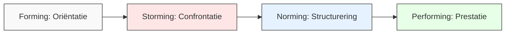
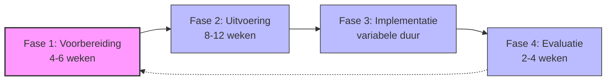
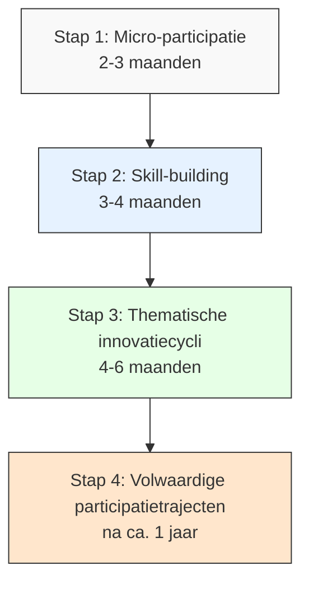

# Hoofdstuk 5: De Structuur en Dynamiek van een Succesvol Participatietraject

In dit hoofdstuk ontdek je hoe je een participatietraject effectief opbouwt en begeleidt. We kijken naar de menselijke kant van participatie, de verschillende fasen van een traject, en hoe je kunt kiezen tussen een volledig traject of een incrementele aanpak.

## De menselijke factor: groepsvorming als fundament

Het succes van participatietrajecten wordt vaak gemeten aan tastbare resultaten zoals efficiëntieverbeteringen of kostenbesparingen. Maar de werkelijke sleutel tot duurzame participatie ligt in de menselijke interacties en groepsprocessen die deze resultaten mogelijk maken.

### De ontwikkelingsfasen van een participatiegroep

Participatiegroepen doorlopen typisch vier ontwikkelingsfasen, gebaseerd op het model van psycholoog Bruce Tuckman:

*Figuur 1: De ontwikkelingsfasen van een participatiegroep*

#### 1. Forming (Oriëntatiefase)
In deze fase leren deelnemers elkaar kennen en tasten ze de grenzen van het proces af. Kenmerken:
- Hoffelijke voorzichtigheid
- Aftasten van verwachtingen
- Zoeken naar veiligheid en structuur

**Tip voor begeleiders:** Besteed in deze fase extra aandacht aan kennismaking, het creëren van psychologische veiligheid en het verhelderen van doelen en kaders.

#### 2. Storming (Confrontatiefase)
In deze fase komen verschillende perspectieven en belangen naar voren, wat kan leiden tot spanning. Kenmerken:
- Constructieve confrontatie
- Verschillende visies worden zichtbaar
- Onderliggende belangen komen aan de oppervlakte

**Tip voor begeleiders:** Zie deze fase als noodzakelijk voor authentieke betrokkenheid. Weersta de verleiding om conflicten te snel glad te strijken. Faciliteer het gesprek zodat verschillende perspectieven gehoord worden.

#### 3. Norming (Structureringsfase)
De groep ontwikkelt gedeelde werkwijzen en afspraken. Kenmerken:
- Ontstaan van gezamenlijke normen
- Ontwikkeling van werkafspraken
- Groeiend onderling vertrouwen

**Tip voor begeleiders:** Help de groep om expliciete afspraken te maken over hoe ze willen samenwerken. Documenteer deze afspraken en verwijs er regelmatig naar.

#### 4. Performing (Prestatiefase)
De groep werkt effectief samen en boekt resultaten. Kenmerken:
- Productieve samenwerking
- Flexibiliteit in rollen
- Focus op gezamenlijke doelen

**Tip voor begeleiders:** Geef de groep in deze fase meer autonomie en focus op het verwijderen van obstakels. Vier successen en help de groep om hun werkwijze continu te verbeteren. Besteed ook aandacht aan de informele leiders binnen de groep, en zorg ervoor dat hun invloed niet te dominant wordt, zodat andere teamleden ook hun inbreng kunnen leveren.

### Het belang van psychologische veiligheid

Participatie gedijt in een omgeving van psychologische veiligheid - een werkklimaat waarin mensen zich vrij voelen om ideeën, vragen, zorgen en fouten te delen zonder angst voor negatieve gevolgen. Onderzoek van Amy Edmondson toont aan dat dit de belangrijkste voorwaarde is voor effectieve teamparticipatie.

**Voor HR-professionals:** Overweeg om psychologische veiligheid te meten als onderdeel van medewerkerstevredenheidsonderzoeken. Gebruik vragen zoals "In ons team kunnen mensen problemen en moeilijke kwesties aankaarten" en "In ons team worden fouten gezien als leermogelijkheden".

### Inclusieve facilitatie

Zonder bewuste interventies domineren vaak dezelfde stemmen de discussie, terwijl waardevolle perspectieven ongehoord blijven. Effectieve facilitatietechnieken zorgen dat alle stemmen tot hun recht komen:

- **Gerichte gespreksrondes:** Iedereen krijgt expliciet de beurt om input te geven
- **Schriftelijke input:** Laat deelnemers eerst individueel ideeën opschrijven voordat de groepsdiscussie start
- **Diverse subgroepen:** Verdeel de groep in kleinere, gemengde teams voor diepere discussies
- **Anonieme ideeëngeneratie:** Gebruik digitale tools die anonieme input mogelijk maken

**Tip voor leidinggevenden:** Wees bewust van je eigen invloed als leidinggevende. Overweeg om bij sommige sessies niet aanwezig te zijn of een neutrale facilitator in te zetten, zodat medewerkers vrijer kunnen spreken.

## De vier fasen van een participatietraject

Een succesvol participatietraject volgt een gestructureerde aanpak die zowel methodisch als flexibel is. Onderzoek toont aan dat trajecten met een duidelijke fasering significant vaker hun doelstellingen behalen dan ad-hoc initiatieven.

*Figuur 2: De vier fasen van een participatietraject*

### Fase 1: Voorbereiding (4-6 weken)

De voorbereidingsfase legt het fundament waarop alle latere activiteiten rusten. Organisaties die voldoende tijd investeren in deze fase, rapporteren aanzienlijk hogere slagingspercentages.

#### Kernactiviteiten:

1. **Stakeholder mapping**
   - Breng directe én indirecte belanghebbenden in kaart
   - Identificeer hun belangen, zorgen en potentiële bijdragen
   - Bepaal hoe en wanneer je hen betrekt

2. **Draagvlakmeting**
   - Peil de bereidheid tot participatie
   - Identificeer specifieke zorgen of weerstanden
   - Bepaal waar extra aandacht nodig is om draagvlak te creëren

3. **Communicatieplan ontwikkelen**
   - Specificeer wat, wanneer en hoe wordt gecommuniceerd
   - Stem boodschappen af op verschillende doelgroepen
   - Zorg voor tweerichtingscommunicatie

4. **Ondersteunende tools selecteren**
   - Kies tools die passen bij de specifieke behoeften van het traject
   - Houd rekening met de digitale volwassenheid van de organisatie
   - Zorg voor toegankelijkheid voor alle deelnemers

**Tip voor HR-professionals:** Betrek een diverse groep medewerkers bij de voorbereiding. Dit creëert vroeg eigenaarschap en zorgt dat het traject aansluit bij de behoeften en mogelijkheden van verschillende groepen in de organisatie.

### Fase 2: Uitvoering (8-12 weken)

De uitvoeringsfase vormt het hart van het participatietraject. Hier vindt de daadwerkelijke betrokkenheid en co-creatie plaats via een cyclus van gerichte interacties.

#### Kernactiviteiten:

1. **Gezamenlijke probleemdefinitie**
   - Verken verschillende perspectieven op het vraagstuk
   - Integreer deze tot een gedeeld begrip
   - Creëer draagvlak voor de probleemstelling

2. **Creatieve ideegeneratie**
   - Verken innovatieve mogelijkheden zonder directe beoordeling
   - Stimuleer out-of-the-box denken
   - Zorg voor een veilige omgeving om ideeën te delen

3. **Gerichte conceptontwikkeling**
   - Werk kansrijke ideeën uit tot concrete voorstellen
   - Toets concepten op haalbaarheid en impact
   - Verfijn op basis van feedback

4. **Transparante besluitvorming**
   - Maak het besluitvormingsproces helder en inclusief
   - Communiceer duidelijk over genomen besluiten
   - Vertaal besluiten naar concrete actieplannen

**Tip voor leidinggevenden:** Wees tijdens deze fase alert op signalen van groeiende cohesie of opkomende spanningen. Pas je facilitatiestijl aan op basis van waar de groep zich bevindt in het ontwikkelingsproces. Momenten van constructieve frictie zijn waardevol; ze leiden vaak tot diepere inzichten en creatievere oplossingen.

### Fase 3: Implementatie (variabele duur)

De implementatiefase vormt de brug tussen ideeën en werkelijkheid - het moment waarop participatie zijn waarde bewijst door daadwerkelijke verandering te realiseren.

#### Kernactiviteiten:

1. **Heldere rolverdeling**
   - Definieer voor elke actie wie verantwoordelijk, aansprakelijk, geraadpleegd en geïnformeerd is (RACI-model)
   - Zorg dat iedereen zijn rol begrijpt
   - Creëer eigenaarschap voor specifieke onderdelen

2. **Voortgangsvisualisatie**
   - Maak voortgang zichtbaar via een dashboard
   - Creëer transparantie over de status van acties
   - Faciliteer tijdige bijsturing

3. **Regelmatige stand-ups**
   - Houd korte, frequente check-ins
   - Houd momentum vast
   - Maak snelle probleemoplossing mogelijk

**Tip voor HR-professionals:** Wees alert op de "implementation dip" - een periode waarin energie en focus kunnen verslappen na de intensieve uitvoeringsfase. Plan bewust momenten om kleine successen te vieren en de verbinding tussen teamleden te onderhouden.

### Fase 4: Evaluatie (2-4 weken)

De evaluatiefase sluit de cyclus en legt tegelijkertijd de basis voor continue verbetering. Een grondige evaluatie transformeert een eenmalig initiatief in een leerervaring die de organisatie duurzaam versterkt.

#### Kernactiviteiten:

1. **360-graden feedbackronde**
   - Verzamel inzichten van alle betrokkenen
   - Evalueer zowel proces als uitkomsten
   - Creëer een compleet beeld van sterktes en verbeterpunten

2. **Waardekwantificering**
   - Kwantificeer waar mogelijk de waarde van het traject
   - Combineer harde en zachte metrics
   - Bouw de business case voor toekomstige participatie-initiatieven

3. **Leerpunten documenteren**
   - Zorg dat inzichten behouden blijven
   - Deel leerpunten met de bredere organisatie
   - Voorkom herhaling van dezelfde fouten

**Tip voor leidinggevenden:** Maak de evaluatie zelf ook participatief. Laat deelnemers meedenken over hoe het proces is verlopen en wat er beter kan. Dit versterkt het leereffect en creëert eigenaarschap voor toekomstige verbeteringen.

## Incrementele ontwikkeling als alternatief

Niet elke organisatie is direct klaar voor een volledig participatietraject zoals hierboven beschreven. Voor organisaties met beperkte ervaring met participatie, hoge werkdruk of specifieke culturele uitdagingen kan een incrementele aanpak effectiever zijn.

### Groeimodel voor participatie

*Figuur 3: Groeimodel voor incrementele ontwikkeling van participatie*

#### Stap 1: Micro-participatie (2-3 maanden)
Begin met kleine, laagdrempelige betrokkenheidsmomenten die gemakkelijk in bestaande werkprocessen passen:
- Korte team-check-ins aan het begin of einde van reguliere vergaderingen
- Digitale ideeënboxen met snelle feedback-loops
- Korte pulse-surveys over specifieke onderwerpen

#### Stap 2: Skill-building (3-4 maanden)
Investeer in het ontwikkelen van vaardigheden die participatie ondersteunen:
- Trainingen in luistervaardigheden
- Workshops over constructieve feedback
- Ontwikkeling van facilitatiecompetenties

#### Stap 3: Thematische innovatiecycli (4-6 maanden)
Pas participatie toe op specifieke uitdagingen of thema's:
- Gerichte verbetertrajecten voor concrete knelpunten
- Innovatiesessies rond specifieke thema's
- Cross-functionele werkgroepen voor afgebakende vraagstukken

#### Stap 4: Volwaardige participatietrajecten (na ca. 1 jaar)
Met de opgebouwde ervaring en vaardigheden kun je overgaan naar meer omvattende trajecten:
- Strategische participatietrajecten
- Organisatiebrede veranderinitiatieven
- Structurele participatie in besluitvorming

**Tip voor HR-professionals:** Dit groeimodel respecteert de "Zone van Naaste Ontwikkeling" - het idee dat groepen en individuen het beste leren door uitdagingen die net buiten hun huidige comfortzone liggen. Door participatie geleidelijk op te bouwen, creëer je een natuurlijk leerpad dat aansluit bij het ontwikkelingsniveau van de organisatie.

## Praktijkvoorbeeld: retailketen transformatie

Een middelgrote Nederlandse retailketen met 35 vestigingen worstelde met stagnerende omzet en toenemende online concurrentie. In plaats van een traditionele top-down herstructurering, koos het management voor een participatieve aanpak.

### Aanpak

#### Voorbereidingsfase
- Grondige stakeholder mapping van winkelpersoneel, hoofdkantoormedewerkers en klanten
- Draagvlakmeting via interviews en surveys
- Ontwikkeling van een communicatieplan met wekelijkse updates

#### Uitvoeringsfase
- Regionale workshops waarin teams door een gestructureerd proces werkten
- Balans tussen openheid voor input van alle niveaus en duidelijke kaders van management
- Combinatie van lokale en centrale sessies om zowel specifieke als overkoepelende uitdagingen aan te pakken

#### Implementatiefase
- Implementatie in drie golven van initiatieven
- "Buddy-aanpak" waarbij voorlopende winkels werden gekoppeld aan winkels die nog moesten beginnen
- Wekelijkse voortgangsvisualisatie via een dashboard

#### Evaluatiefase
- Kwantitatieve meting van resultaten (omzet, klanttevredenheid, medewerkerstevredenheid)
- Kwalitatieve evaluatie via focusgroepen
- Documentatie van leerpunten voor toekomstige trajecten

### Resultaten
- 18% omzetstijging in pilotwinkels
- 92% medewerkerstevredenheid (een stijging van 23 procentpunten)
- Blijvende cultuurverandering waarbij winkelpersoneel proactief verbetervoorstellen is gaan indienen

### Succesfactoren
- Oprechte waardering voor de expertise en inzichten van frontline medewerkers
- Duidelijke kaders gecombineerd met substantiële beslissingsruimte
- Peer-to-peer kennisdeling tussen winkels
- Zichtbare steun van senior management

## De balans tussen structuur en menselijkheid

Een succesvol participatietraject vindt de juiste balans tussen methodische structuur en mensgerichte processen. De fasering en tools bieden het skelet, maar de aandacht voor groepsdynamica, vertrouwen en inclusie vormt het kloppende hart van participatie.

### Praktische overwegingen bij het ontwerpen van je traject

#### Tijdsinvestering
Overweeg zorgvuldig welke tijdsinvestering realistisch is voor jouw organisatie:
- Hoeveel tijd kunnen deelnemers vrijmaken naast hun reguliere werk?
- Welke ondersteuning is beschikbaar voor facilitatie en coördinatie?
- Hoe urgent is het vraagstuk dat je wilt aanpakken?

#### Fasering
Bepaal hoe je het traject wilt faseren:
- Is een volledig traject nodig, of past een incrementele aanpak beter?
- Welke fasen vereisen meer of minder tijd in jouw specifieke context?
- Hoe sluit je aan bij bestaande plannings- en besluitvormingscycli?

#### Schaal
Denk na over de optimale schaal voor je traject:
- Begin je met een pilot in één team of afdeling?
- Hoe zorg je voor representativiteit zonder het proces te complex te maken?
- Hoe schaal je succesvolle aanpakken op naar de bredere organisatie?

**Tip voor leidinggevenden:** Participatietrajecten die te ambitieus starten, lopen het risico halverwege te stranden door resource-uitputting of prioriteitsverschuivingen. Begin liever klein en bouw succes op succes, dan te groot te beginnen en momentum te verliezen.

## Aan de slag: bepaal je aanpak

> **Reflectievraag:**  
> "Welke tijdsinvestering zou realistisch zijn voor een eerste participatietraject in jouw organisatie? Hoe zou je dit faseren?"

### Praktische tip

Overweeg of een incrementele aanpak beter past bij jouw organisatie dan een volledig uitgerold traject. Soms is klein beginnen en organisch groeien effectiever dan direct groots uitrollen. Begin bijvoorbeeld met:

1. Een wekelijkse 15-minuten participatiesessie in teamoverleggen
2. Een maandelijkse thematische verbeterworkshop
3. Een kwartaalse innovatiedag

Door succeservaringen te creëren, bouw je natuurlijk momentum op voor meer omvattende participatie in de toekomst.

[Download tijdsinschattingstool](/hoofdstukken/tijdsinschattingstool.md){ .md-button .md-button--primary }
