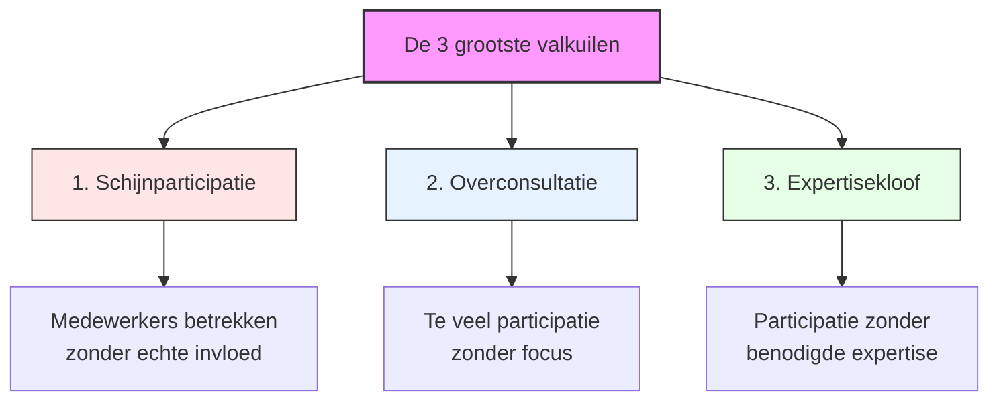
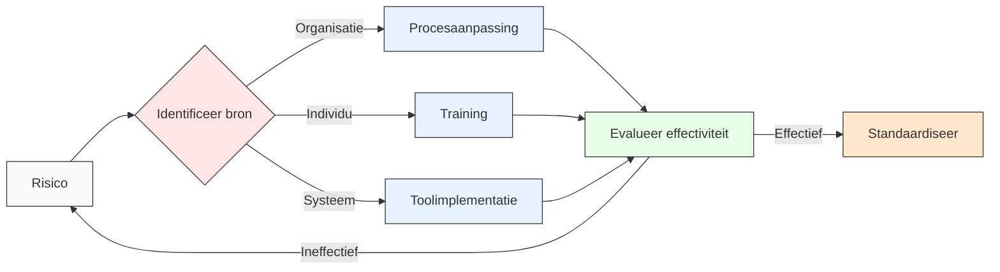

# Hoofdstuk 6: Valkuilen en Oplossingen bij Medewerkerparticipatie

In dit hoofdstuk ontdek je de meest voorkomende valkuilen bij medewerkerparticipatie en hoe je deze kunt vermijden. We bieden concrete oplossingen, praktijkvoorbeelden en preventiestrategieën om je participatietrajecten succesvol te maken.

## De realiteit van participatierisico's

De weg naar succesvolle medewerkerparticipatie is zelden zonder hindernissen. Onderzoek van Deloitte toont aan dat ruim 62% van de participatie-initiatieven niet de beoogde resultaten behaalt, vaak door vermijdbare fouten. Het herkennen en proactief adresseren van deze risico's vormt de basis voor duurzaam succes.

*Figuur 1: De drie grootste valkuilen bij medewerkerparticipatie*

## Het fundament: heldere participatiekaders

De essentie van effectieve medewerkerparticipatie ligt in het vooraf creëren van duidelijke kaders. Deze kaders definiëren de precieze ruimte waarbinnen medewerkers invloed kunnen uitoefenen en vormen een impliciet contract tussen medewerkers en leiding.

**Cruciaal principe:** Nadat de kaders zijn vastgesteld, grijpt de leiding niet meer in binnen de afgesproken beslissingsruimte. Dit is fundamenteel voor het opbouwen van vertrouwen en het stimuleren van oprechte betrokkenheid.

**Praktijkvoorbeeld:** Een technologiebedrijf implementeerde dit principe via hun "Participation Clarity Framework", waarbij elk participatie-initiatief vooraf een classificatie krijgt op een schaal van 1 (puur consultatief) tot 5 (volledige delegatie). Deze transparantie leidde tot een stijging van 41% in het vertrouwen dat medewerkersinput serieus werd genomen, zelfs wanneer niet alle suggesties uiteindelijk werden geïmplementeerd.

**Tip voor HR-professionals:** Ontwikkel een eenvoudig classificatiesysteem voor participatie-initiatieven dat duidelijk maakt welke mate van invloed medewerkers hebben. Communiceer dit vooraf bij elke participatieactiviteit.

## De drie kritieke valkuilen

### 1. Schijnparticipatie: de vertrouwensbreker

Schijnparticipatie vormt wellicht de meest schadelijke valkuil binnen participatietrajecten. Het ontstaat wanneer medewerkers formeel worden betrokken bij besluitvorming, maar hun input in werkelijkheid geen invloed heeft op de uitkomst.

#### Impact

Onderzoek van de Erasmus Universiteit toont aan dat:
- 73% van de medewerkers kan detecteren wanneer participatie niet oprecht is
- Het vertrouwen in het management daalt hierdoor met gemiddeld 34%
- De bereidheid om in toekomstige initiatieven te participeren neemt af met 58%

#### Herkenningspunten

- Beslissingen staan in feite al vast voordat participatie plaatsvindt
- Feedback wordt verzameld maar niet verwerkt in eindresultaten
- Er is geen transparantie over wat er met input gebeurt
- Medewerkers uiten frustratie over "weer een praatsessie zonder gevolg"

#### Oplossing: transparante beslissingskaders

De sleutel tot het vermijden van schijnparticipatie ligt in absolute helderheid over de beslissingsruimte vooraf:

1. **Expliciete communicatie** over welke aspecten open staan voor beïnvloeding en welke niet
2. **Duidelijke beslissingsmatrix** die specificeert of medewerkersinput adviserend of bindend is
3. **Vooraf gedefinieerde criteria** voor het evalueren en selecteren van ideeën
4. **Systematische terugkoppeling** over wat er met input is gebeurd en waarom bepaalde suggesties wel of niet zijn overgenomen

**Tip voor leidinggevenden:** Als je merkt dat een beslissing eigenlijk al vaststaat, wees dan eerlijk en kies voor een informatiesessie in plaats van een participatiesessie. Medewerkers waarderen eerlijkheid meer dan schijnbetrokkenheid.

### 2. Overconsultatie: de participatiemoeheid

Waar schijnparticipatie te weinig echte betrokkenheid biedt, creëert overconsultatie het tegenovergestelde probleem: een overvloed aan participatiemomenten zonder focus of efficiëntie.

#### Impact

Onderzoek van McKinsey toont aan dat:
- Organisaties die meer dan 20% van de werktijd besteden aan participatieve processen, een significante daling in productiviteit ervaren
- De relatie tussen participatietijd en effectiviteit volgt een omgekeerde U-curve
- Het optimum ligt meestal rond 15% van de werktijd

#### Herkenningspunten

- Vermoeidheid en irritatie door te veel overlegmomenten
- Dalende opkomst bij participatiesessies
- Oppervlakkige bijdragen door tijdsdruk
- Vertraging in besluitvorming door eindeloze consultatierondes

#### Oplossing: duidelijke agenda en tijdslimieten

Effectieve participatie vereist discipline en focus:

1. **Stel voor elk participatiemoment een scherpe, specifieke vraag centraal**
2. **Implementeer strikte tijdslimieten** voor discussies en besluitvorming
3. **Gebruik gefaseerde participatie** waarbij eerst brede input wordt verzameld, gevolgd door gerichte verdieping met kleinere groepen
4. **Pas de intensiteit van participatie aan** op basis van de impact en complexiteit van het vraagstuk

**Praktijkvoorbeeld:** Een financiële instelling adresseerde dit risico met hun "Focused Participation Protocol", waarbij participatiesessies beperkt worden tot maximaal 90 minuten, met een duidelijke vooraf gecommuniceerde agenda en beslissingsvraag. Deze aanpak heeft geleid tot een 28% reductie in totale vergadertijd, terwijl de kwaliteit van de input met 45% is gestegen.

**Tip voor HR-professionals:** Ontwikkel een participatiekalender die zorgt voor een evenwichtige spreiding van participatiemomenten. Voorkom dat afdelingen of teams worden overvraagd door meerdere initiatieven tegelijk.

### 3. Expertisekloof: de kwaliteitsondermijner

Een derde kritieke valkuil ontstaat wanneer participatie plaatsvindt zonder de noodzakelijke expertise of informatie. Dit leidt tot beslissingen die weliswaar breed gedragen zijn, maar technisch of strategisch suboptimaal.

#### Impact

Onderzoek van Harvard Business Review toont aan dat participatieve besluitvorming zonder adequate expertise leidt tot:
- 3,2 keer meer implementatieproblemen
- 2,7 keer hogere correctiekosten

#### Herkenningspunten

- Beslissingen zonder vakkundige input of onderbouwing
- Oplossingen die praktisch niet uitvoerbaar blijken
- Frustratie bij specialisten wiens expertise wordt genegeerd
- Implementatieproblemen door onvoorziene technische complicaties

#### Oplossing: gerichte expertisepanels

De uitdaging is om participatie en expertise te combineren zonder één van beide te compromitteren:

1. **Organiseer getrapte besluitvorming** waarbij brede participatie wordt gecombineerd met gerichte expertisechecks
2. **Stel cross-functionele teams samen** die verschillende kennisdomeinen vertegenwoordigen
3. **Implementeer een "expertise-op-afroep" systeem** waarbij specialisten beschikbaar zijn voor consultatie
4. **Zorg voor toegankelijke kennisdeling** voorafgaand aan participatiemomenten

**Praktijkvoorbeeld:** Shell implementeerde een "Technical Authority Framework" dat expertise integreert in participatieve processen door voor elk domein een "authority" aan te wijzen die verantwoordelijk is voor het valideren van de haalbaarheid van voorstellen. Dit systeem heeft geleid tot een 64% reductie in implementatieproblemen, terwijl het participatieniveau hoog bleef.

**Tip voor leidinggevenden:** Maak een onderscheid tussen "wat"-vragen (wat willen we bereiken?) en "hoe"-vragen (hoe gaan we dat technisch realiseren?). Brede participatie werkt vaak beter voor "wat"-vragen, terwijl "hoe"-vragen meer expertise vereisen.

## Participatie-governance: structuur zonder bureaucratie

Duidelijke governance is essentieel om participatie te structureren zonder het te bureaucratiseren. Dit betekent het definiëren van rollen en verantwoordelijkheden, het vaststellen van besluitvormingsprotocollen, en het creëren van escalatiepaden.

### Elementen van effectieve participatie-governance

1. **Rolverheldering**
   - Wie faciliteert het proces?
   - Wie heeft beslissingsbevoegdheid?
   - Wie is verantwoordelijk voor implementatie?

2. **Besluitvormingsprotocollen**
   - Welke beslissingen vereisen consensus vs. consent (geen bezwaar)?
   - Hoe worden conflicten opgelost?
   - Wanneer en hoe wordt management betrokken?

3. **Escalatiepaden**
   - Wat gebeurt er als het participatieproces vastloopt?
   - Wie heeft de bevoegdheid om in te grijpen?
   - Onder welke omstandigheden wordt een beslissing "naar boven" geschaald?

**Praktijkvoorbeeld:** Een chemiebedrijf's "Participative Governance Framework" specificeert welke beslissingen op welk niveau worden genomen, met duidelijke criteria voor wanneer consensus vereist is versus wanneer consent volstaat. Dit heeft de besluitvormingssnelheid met 34% verhoogd zonder de kwaliteit of het draagvlak te compromitteren.

## Risicomatrix: systematisch risicomanagement

Naast de drie kritieke valkuilen zijn er diverse andere risico's die het succes van participatie-initiatieven kunnen bedreigen. Een systematische risico-inventarisatie en -mitigatie is essentieel voor robuuste implementatie.

| Risico | Waarschijnlijkheid | Impact | Mitigatie | Voorbeeld |
|--------|-------------------|--------|-----------|-----------|
| **Gebrek aan follow-up** | Hoog | Middel | Automatische herinneringssystemen | Een bank's "Action Tracker" verhoogde follow-up van 62% naar 91% |
| **Rolverwarring** | Middel | Hoog | RACI-matrix implementeren | Een verzekeraar's digitale RACI-tool zorgt voor duidelijke verantwoordelijkheden |
| **Data-overload** | Laag | Hoog | Visuele dashboards | Een telecomprovider's "Insight Visualizer" verminderde besluitvormingstijd met 37% |
| **Dominante stemmen** | Hoog | Middel | Gestructureerde facilitatietechnieken | Een technologiebedrijf's "Equal Voice Protocol" verhoogde bijdragen van stille deelnemers met 52% |
| **Weerstand middenmanagement** | Hoog | Hoog | Gerichte coaching en incentives | Een bank's "Participative Leadership Bonus" verminderde weerstand met 64% |
| **Culturele barrières** | Middel | Hoog | Cultuurspecifieke aanpassingen | Een oliebedrijf's cultuurspecifieke participatieprotocollen verhoogden effectiviteit met 43% |
| **Technische beperkingen** | Laag | Middel | IT-ondersteuning op afroep | Een bank's "Tech Support Hotline" voor participatiesessies |

**Tip voor HR-professionals:** Voer voorafgaand aan elk participatietraject een korte risico-assessment uit. Identificeer de 2-3 meest waarschijnlijke risico's voor jouw specifieke context en ontwikkel gerichte mitigatiestrategieën.

## Leren van mislukkingen: de manufacturing fiasco

Een leerzaam voorbeeld van hoe participatievalkuilen kunnen leiden tot kostbare mislukkingen komt van een middelgrote Nederlandse producent van industriële componenten.

### Situatie

De producent besloot in 2023 een verouderde productielijn te vernieuwen en koos voor een participatieve aanpak om draagvlak te creëren en praktijkkennis te benutten. Een breed samengesteld team van operators, teamleiders, en ondersteunende functies kreeg de opdracht om specificaties voor de nieuwe lijn te ontwikkelen.

### Wat er misging

1. **Expertisekloof:** Hoewel operators waardevolle inzichten hadden in de dagelijkse operatie, ontbrak technische expertise over geavanceerde productietechnologieën. Ingenieurs werden pas in een laat stadium geconsulteerd.

2. **Onduidelijke kaders:** Het management communiceerde niet duidelijk welke aspecten vastlagen (budget, tijdlijn, bepaalde technische vereisten) en welke open stonden voor input.

3. **Gebrek aan processtructuur:** Participatiesessies verliepen ongestructureerd, zonder duidelijke agenda of besluitvormingsmethode.

4. **Onvoldoende follow-up:** Actiepunten werden niet systematisch gedocumenteerd of opgevolgd.

### Gevolgen

- 6 maanden vertraging in de implementatie
- €250.000 aan extra kosten voor aanpassingen en correcties
- Significante productieverstoringen tijdens de overgang
- Verminderd vertrouwen in participatieve processen

### Correctie

Na deze kostbare les implementeerde de organisatie een herziene participatieaanpak:

1. **Technisch adviespanel:** Een permanent panel van technische experts werd geïntegreerd in het participatieproces.

2. **Fasegewijze goedkeuringen:** Het proces werd opgedeeld in discrete fasen, elk met duidelijke deliverables en formele goedkeuringsmomenten.

3. **Real-time budgettracking:** Een transparant dashboard toonde continu de financiële implicaties van beslissingen.

4. **Gestructureerde facilitatie:** Professionele facilitators werden ingezet om participatiesessies te leiden.

Deze correcties werden toegepast bij een volgende modernisering van een andere productielijn, met dramatisch betere resultaten: het project werd binnen budget en slechts 2 weken na de geplande datum opgeleverd, met 92% tevredenheid onder operators en 30% hogere productiviteit dan de oude lijn.

## Systematische risicomitigatie

*Figuur 2: Systematische aanpak voor risicomitigatie*

Dit stroomdiagram illustreert een systematische aanpak voor het identificeren en mitigeren van participatierisico's. Door de bron van het risico te categoriseren (organisatorisch, individueel of systemisch), kunnen gerichte interventies worden ontwikkeld.

## Preventiestrategieën: voorkomen is beter dan genezen

Naast het adresseren van specifieke risico's, kunnen organisaties bredere preventiestrategieën implementeren die de algehele robuustheid van participatieprocessen versterken.

### 1. Participatie readiness assessment

Voordat een participatietraject wordt gestart, is het waardevol om de organisatorische gereedheid te evalueren:

- Bestaande participatiecultuur en -ervaring
- Leiderschapsstijlen en -vaardigheden
- Beschikbare tijd en resources
- Technische infrastructuur voor collaboratie
- Potentiële weerstandsbronnen

**Praktijkvoorbeeld:** Een bank's "Participation Readiness Scan" identificeert specifieke risicofactoren en genereert een gepersonaliseerd mitigatieplan. Afdelingen die deze scan gebruikten voorafgaand aan participatie-initiatieven rapporteerden 47% minder implementatieproblemen.

**Tip voor HR-professionals:** Ontwikkel een eenvoudige checklist met 5-10 vragen die teams kunnen gebruiken om hun readiness voor participatie te beoordelen. Koppel hier concrete aanbevelingen aan voor gebieden die versterking nodig hebben.

### 2. Gefaseerde implementatie

In plaats van participatie direct grootschalig uit te rollen, is een gefaseerde aanpak vaak effectiever:

1. **Begin met een beperkt, laagrisico pilotproject**
2. **Evalueer grondig en pas aan** op basis van leerervaringen
3. **Schaal geleidelijk op** naar complexere of bredere toepassingen
4. **Bouw een "participatie-community"** van ervaren facilitators en champions

**Praktijkvoorbeeld:** Unilever's "Participation Scaling Framework" definieert vier volwassenheidsniveaus, elk met specifieke succesindicatoren die behaald moeten worden voordat wordt opgeschaald naar het volgende niveau. Dit heeft het slagingspercentage van participatie-initiatieven verhoogd van 43% naar 81%.

### 3. Continuous learning loop

Een lerende aanpak zorgt ervoor dat participatie-initiatieven continu verbeteren:

1. **Implementeer systematische reflectiemomenten** na elke participatiefase
2. **Documenteer en deel leerervaringen** organisatiebreed
3. **Bouw een kennisbank** van best practices en lessons learned
4. **Creëer communities of practice** rond participatief leiderschap

**Praktijkvoorbeeld:** Shell's "Participation Learning Cycle" integreert formele evaluatiemomenten in elk participatietraject, met gestandaardiseerde metrics die vergelijking tussen initiatieven mogelijk maken. De inzichten worden gedeeld via een digitaal platform en periodieke leersessies.

**Tip voor leidinggevenden:** Plan na elk participatietraject een korte retrospective (30-60 minuten) waarin het team reflecteert op wat goed ging, wat beter kon, en welke concrete verbeteringen ze bij een volgend traject zouden implementeren.

## Aan de slag: identificeer jouw risico's

> **Reflectievraag:**  
> "Welke risico's zie jij als meest urgent voor jouw organisatie? Welke preventiemaatregelen zou je direct kunnen nemen?"

### Praktische tip

Begin met een gerichte risico-inventarisatie voor jouw specifieke context:

1. **Identificeer de top-3 risico's** die het meest relevant zijn voor jouw organisatie, gebaseerd op eerdere ervaringen en organisatiecultuur
2. **Bepaal voor elk risico één concrete preventiemaatregel** die je binnen 2 weken kunt implementeren
3. **Start klein en bouw voort op successen** - een eenvoudige maar consequent toegepaste maatregel is effectiever dan een ambitieus plan dat niet wordt uitgevoerd

Bijvoorbeeld:
- Als schijnparticipatie een risico is, implementeer dan een eenvoudig classificatiesysteem dat bij elke participatieactiviteit duidelijk maakt welke mate van invloed medewerkers hebben
- Als overconsultatie een zorg is, voer dan een participatiekalender in die zorgt voor een evenwichtige spreiding van participatiemomenten
- Als expertisekloof een uitdaging vormt, creëer dan een lijst van interne experts die op afroep beschikbaar zijn voor consultatie tijdens participatieprocessen

[Download risico-assessment tool](/hoofdstukken/risico-assessment.md){ .md-button .md-button--primary }
