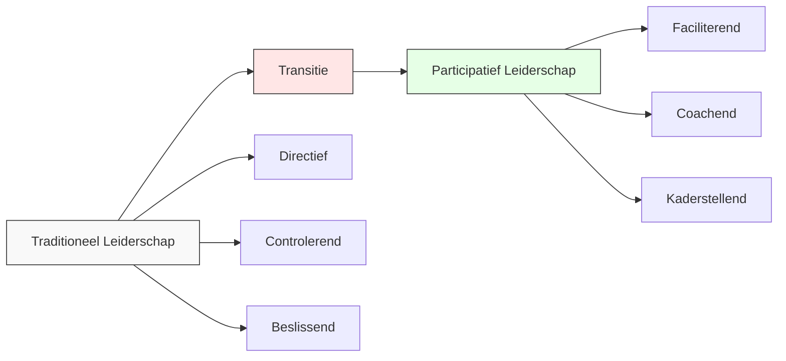
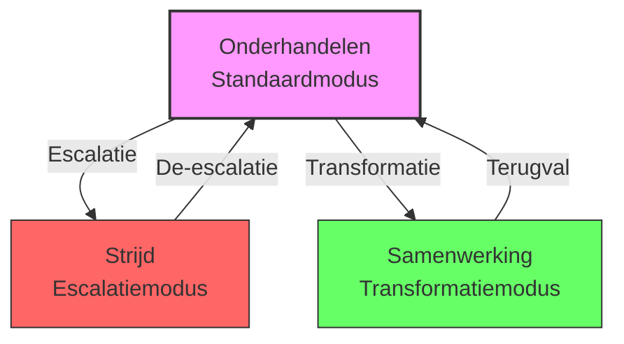
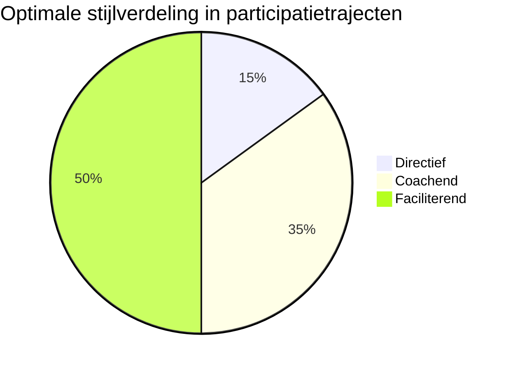
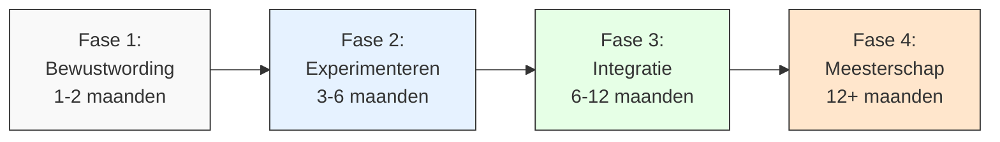

# Hoofdstuk 7: De Rol van de Leidinggevende

In dit hoofdstuk ontdek je welke leiderschapsvaardigheden essentieel zijn voor succesvolle medewerkerparticipatie. We kijken naar de kerncompetenties van participatief leiderschap, verschillende leiderschapsstijlen, en hoe je deze vaardigheden stap voor stap kunt ontwikkelen.

## Van traditioneel naar participatief leiderschap

De transitie naar een participatieve organisatie vereist een fundamentele verschuiving in de rol van leidinggevenden. Waar traditioneel leiderschap vaak draait om directieve sturing en controle, vraagt participatief leiderschap om een andere mindset en vaardighedenset.

Onderzoek toont aan dat leidinggevenden die deze transitie succesvol maken:
- Drie keer effectiever zijn in het implementeren van organisatieveranderingen
- Twee keer hogere medewerkerstevredenheidsscores behalen
- Significant meer innovatie en creativiteit in hun teams stimuleren

*Figuur 1: De transitie van traditioneel naar participatief leiderschap*

## Drie kerncompetenties voor participatief leiderschap

### 1. Faciliterend leiderschap

De kern van participatief leiderschap is de verschuiving van "leider als beslisser" naar "leider als facilitator". Deze faciliterende rol omvat drie kritieke elementen:

#### Creëren van psychologische veiligheid

Psychologische veiligheid - het gevoel dat men zich kwetsbaar kan opstellen zonder negatieve consequenties - is de fundamentele voorwaarde voor oprechte participatie. Teams met hoge psychologische veiligheid genereren significant meer innovatieve ideeën en zijn effectiever in probleemoplossing.

**Praktische gedragsprincipes:**
- Modelleer kwetsbaarheid door eigen fouten te erkennen
- Reageer nieuwsgierig op afwijkende meningen
- Luister actief zonder direct te oordelen
- Frame feedback als een gezamenlijke zoektocht naar verbetering

**Praktijkvoorbeeld:** Een financiële instelling trainde leidinggevenden in deze vier gedragsprincipes, wat leidde tot een significante stijging in het aantal gerapporteerde verbetervoorstellen.

**Tip voor leidinggevenden:** Begin elke participatiesessie met een korte check-in waarin je expliciet benoemt dat alle ideeën en perspectieven welkom zijn. Reageer consistent positief op bijdragen, zelfs als ze uitdagend of kritisch zijn.

#### Balans tussen sturen en loslaten

Effectieve participatieve leiders vinden een delicate balans tussen kaders stellen en ruimte geven. Ze definiëren duidelijke grenzen en verwachtingen, maar laten binnen die grenzen maximale autonomie toe.

**Praktische toepassing:**
- Wees duidelijk over niet-onderhandelbare randvoorwaarden (budget, tijdlijn, wettelijke vereisten)
- Specificeer het gewenste eindresultaat, niet de weg ernaartoe
- Pas je stijl aan op basis van de situatie en de ontwikkelingsfase van je team
- Wees consistent in principes, maar flexibel in de toepassing

**Praktijkvoorbeeld:** Een technologiebedrijf ontwikkelde een raamwerk dat specificeert wanneer verschillende leiderschapsstijlen passend zijn: directief bij crisis of veiligheidskwesties, coachend bij ontwikkeling van nieuwe vaardigheden, en faciliterend bij innovatie en procesverbetering.

#### Conflictmediatievaardigheden

Participatie leidt onvermijdelijk tot het zichtbaar worden van verschillende perspectieven en belangen. De vaardigheid om deze verschillen productief te maken in plaats van destructief, is essentieel voor participatief leiderschap.

**Het model van onderhandelen, strijd en samenwerking**

In de interactie tussen leidinggevenden en medewerkers kunnen drie fundamentele relatiepatronen worden onderscheiden:

*Figuur 2: De drie interactiepatronen tussen leiding en medewerkers*

**Onderhandelen (de standaardmodus):**
In veel organisaties is onderhandelen de default interactiemodus. Beide partijen zien elkaar als tegenspelers met deels overlappende, deels conflicterende belangen.

Kenmerken:
- Focus op posities en compromissen
- Impliciete of expliciete ruilrelaties ("als jij X doet, dan krijg je Y")
- Strategisch informatiemanagement (niet alle kaarten op tafel)
- Resultaat: suboptimale oplossingen die niemand volledig tevreden stellen

**Strijd (de escalatiemodus):**
Wanneer onderhandelen vastloopt, kan de relatie escaleren naar strijd.

Kenmerken:
- Focus op winnen ten koste van de ander
- Verharding van standpunten
- Persoonlijke aanvallen en defensieve reacties
- Resultaat: beschadigde relaties en verlies van vertrouwen

**Samenwerking (de transformatiemodus):**
De meest productieve maar ook meest uitdagende relatievorm.

Kenmerken:
- Focus op gezamenlijke probleemoplossing
- Transparante uitwisseling van informatie en perspectieven
- Exploratie van onderliggende belangen in plaats van posities
- Resultaat: innovatieve oplossingen die voor alle partijen meerwaarde creëren

**Vaardigheden voor transformatie naar samenwerking:**
1. **Belangen identificeren:** Kijk voorbij posities naar de onderliggende behoeften, zorgen en aspiraties van alle betrokkenen
2. **Gemeenschappelijke doelen articuleren:** Formuleer overkoepelende doelen die individuele belangen overstijgen
3. **Procesontwerp:** Creëer interactieprocessen die samenwerking faciliteren in plaats van competitie aanmoedigen
4. **Vertrouwen opbouwen:** Vertoon consistent betrouwbaar gedrag en bevorder transparantie

**Praktijkvoorbeeld:** Een energiebedrijf implementeerde dit model in hun leiderschapsontwikkelingsprogramma, waarbij leidinggevenden leerden om bewust te schakelen van onderhandelen naar samenwerken. Dit resulteerde in 42% meer constructieve uitkomsten van teamconflicten en significant snellere besluitvorming bij complexe vraagstukken.

**Tip voor HR-professionals:** Ontwikkel een korte training voor leidinggevenden over het herkennen van en omgaan met deze drie interactiepatronen. Focus op concrete technieken om van onderhandelen naar samenwerking te bewegen.

### 2. Besluitvormingsarchitectuur

Participatief leiderschap vereist niet alleen interpersoonlijke vaardigheden, maar ook het vermogen om besluitvormingsprocessen zodanig te structureren dat ze participatie faciliteren zonder te verzanden in eindeloze discussies of onduidelijke verantwoordelijkheden.

#### Beslisniveaus bepalen (consult vs consent)

Niet alle beslissingen lenen zich voor dezelfde mate van participatie. Effectieve leiders maken expliciet onderscheid tussen verschillende besluitvormingsniveaus en communiceren dit transparant.

**Vier besluitvormingsniveaus:**

1. **Informeren:** Beslissing is genomen, wordt alleen gecommuniceerd
   - Wanneer toepassen: Bij niet-onderhandelbare zaken (wettelijke vereisten, veiligheid)
   - Communicatie: Duidelijk uitleggen waarom deze beslissing niet participatief kan zijn

2. **Consulteren:** Input wordt gevraagd maar is niet bindend
   - Wanneer toepassen: Bij beslissingen die expertise vereisen maar waar gebruikersperspectief waardevol is
   - Communicatie: Duidelijk maken hoe input wordt meegewogen en terugkoppelen wat ermee is gedaan

3. **Consenteren:** Beslissing wordt genomen tenzij er zwaarwegende bezwaren zijn
   - Wanneer toepassen: Bij beslissingen met brede impact waar draagvlak essentieel is
   - Communicatie: Proces voor het uiten van bezwaren helder maken

4. **Consensus:** Actieve instemming van alle betrokkenen vereist
   - Wanneer toepassen: Bij fundamentele beslissingen die volledige commitment vereisen
   - Communicatie: Duidelijk proces voor het bereiken van consensus afspreken

**Praktijkvoorbeeld:** Een coöperatieve bank die dit model implementeerde, rapporteerde een significante reductie in frustratie over besluitvormingsprocessen. Medewerkers waardeerden de transparantie over welk type besluitvorming van toepassing was, zelfs wanneer ze niet de volledige beslissingsbevoegdheid hadden.

#### Escalatieprocedures ontwerpen

Zelfs de best ontworpen participatieve processen kunnen vastlopen. Effectieve leiders creëren duidelijke paden voor wanneer dit gebeurt, zodat impasses niet leiden tot verlamming of terugval naar autoritaire besluitvorming.

**Elementen van een effectieve escalatieprocedure:**
- Specifieke criteria voor wanneer een beslissing geëscaleerd moet worden
- Duidelijkheid over wie betrokken wordt bij verschillende escalatieniveaus
- Concrete tijdslijnen voor elk escalatieniveau
- Transparante communicatie over het proces en de uitkomst

**Praktijkvoorbeeld:** Bij een internationale financiële instelling heeft een dergelijk raamwerk de gemiddelde tijd om tot een besluit te komen bij complexe vraagstukken significant verminderd.

#### Transparante terugkoppeling garanderen

De cirkel van participatie wordt pas echt gesloten wanneer deelnemers zien wat er met hun input gebeurt. Effectieve leiders zorgen voor systematische terugkoppeling, zelfs - of juist - wanneer niet alle suggesties worden overgenomen.

**Elementen van effectieve terugkoppeling:**
- Tijdig: Binnen een vooraf afgesproken termijn
- Volledig: Alle ontvangen input wordt geadresseerd
- Specifiek: Concrete uitleg waarom ideeën wel of niet worden overgenomen
- Respectvol: Waardering voor alle bijdragen, ongeacht of ze worden geïmplementeerd

**Tip voor leidinggevenden:** Ontwikkel een standaard terugkoppelingsformat dat je na elke participatiesessie gebruikt. Deel dit binnen 48 uur na de sessie met alle deelnemers, zodat ze zien wat er met hun input gebeurt.

### 3. Feedback meesterschap

In een participatieve organisatie is feedback niet langer een jaarlijks ritueel, maar een continue stroom van informatie die in alle richtingen vloeit - van leidinggevende naar medewerker, van medewerker naar leidinggevende, en tussen medewerkers onderling.

#### 360° feedback implementatie

Traditionele top-down beoordelingen maken plaats voor multidirectionele feedback die een completer beeld geeft van iemands functioneren en ontwikkeling.

**Kenmerken van effectieve 360° feedback:**
- Input van diverse bronnen: leidinggevenden, collega's, interne klanten, externe stakeholders
- Focus op ontwikkeling, niet op beoordeling
- Specifieke gedragingen en hun impact, niet algemene persoonlijkheidskenmerken
- Concrete, actionable suggesties voor verbetering

**Praktijkvoorbeeld:** Bij een grote bank leidde de implementatie van 360° feedback tot significant meer gerichte ontwikkelingsplannen en hogere tevredenheid met het feedbackproces.

#### Real-time feedforward systemen

Naast periodieke formele feedback, faciliteren effectieve leiders continue, informele uitwisseling van observaties en suggesties, gericht op toekomstige verbetering in plaats van beoordeling van het verleden.

**Kenmerken van effectieve feedforward:**
- Toekomstgericht in plaats van retrospectief
- Specifiek en actionable
- Positief geformuleerd als suggestie, niet als kritiek
- Frequent en laagdrempelig

**Praktijkvoorbeeld:** Organisaties die feedforward-systemen implementeren zien een significante toename in de frequentie van peer-to-peer feedback en concrete verbeteringen op basis van ontvangen suggesties.

**Tip voor HR-professionals:** Implementeer een eenvoudig digitaal platform waar medewerkers laagdrempelig feedforward kunnen geven aan collega's. Train medewerkers in het geven van constructieve, toekomstgerichte suggesties.

#### Psychologische veiligheid meten

Effectieve leiders monitoren systematisch de psychologische veiligheid in hun teams, omdat dit de fundamentele voorwaarde is voor oprechte participatie en eerlijke feedback.

**Voorbeeldvragen voor het meten van psychologische veiligheid:**
- "Ik durf fouten toe te geven in dit team"
- "Afwijkende meningen worden gewaardeerd in onze discussies"
- "Ik voel me vrij om risico's te nemen in mijn werk"
- "Als ik een probleem zie, voel ik me veilig om dit aan te kaarten"

**Praktijkvoorbeeld:** Een chemieconcern dat regelmatig psychologische veiligheid meet, rapporteerde een significante stijging in gerapporteerde veiligheid over een periode van twee jaar, gekoppeld aan gerichte interventies voor teams die laag scoorden.

## Leiderschapsstijlen matrix: flexibel schakelen

De effectiviteit van verschillende leiderschapsstijlen varieert afhankelijk van de fase van het participatietraject en de specifieke context. Een flexibele, situationele benadering is daarom essentieel.

*Figuur 3: Optimale verdeling van leiderschapsstijlen in een participatietraject*

### Directieve stijl (15%)

Deze stijl is met name waardevol in specifieke situaties:
- In de beginfase van een traject, bij het stellen van kaders
- Bij niet-onderhandelbare randvoorwaarden
- In situaties waar snelle besluitvorming cruciaal is (veiligheidskwesties, acute crises)

**Kenmerken:**
- Duidelijke instructies en verwachtingen
- Expliciete grenzen en kaders
- Besluitvaardigheid
- Heldere communicatie

**Tip voor leidinggevenden:** Wees transparant wanneer je een directieve stijl hanteert. Leg uit waarom deze aanpak in deze specifieke situatie nodig is, zodat medewerkers begrijpen dat het geen terugval is naar een niet-participatieve cultuur.

### Coachende stijl (35%)

Deze stijl is bijzonder effectief tijdens de ontwikkelingsfase van participatieve vaardigheden, wanneer teams nog leren hoe ze effectief kunnen samenwerken in een meer autonome setting.

**Kenmerken:**
- Vragen stellen in plaats van antwoorden geven
- Reflectie stimuleren
- Ondersteuning bieden bij het vinden van eigen oplossingen
- Balans tussen uitdaging en ondersteuning

**Krachtige coachingsvragen:**
- "Wat zou gebeuren als deze beperking er niet was?"
- "Hoe zou je dit aanpakken als je volledige autonomie had?"
- "Wat heb je nodig om de volgende stap te zetten?"
- "Welke andere perspectieven zouden waardevol kunnen zijn?"

**Tip voor HR-professionals:** Ontwikkel een toolkit met coachingsvragen die leidinggevenden kunnen gebruiken in verschillende situaties. Train hen in het stellen van open, reflectieve vragen die participatie stimuleren.

### Faciliterende stijl (50%)

Deze stijl domineert in de uitvoeringsfase van participatietrajecten, wanneer teams de capaciteit hebben ontwikkeld om zelfstandig te functioneren.

**Kenmerken:**
- Focus op het proces, niet op de inhoud
- Creëren van optimale condities voor teameffectiviteit
- Verwijderen van obstakels
- Verbinden van het team met de bredere organisatie

**Facilitatietechnieken:**
- Visuele facilitatie (werken met post-its, whiteboards, digitale tools)
- Gestructureerde besluitvormingsmethoden (dot-voting, fist-to-five, etc.)
- Inclusieve discussietechnieken (rondes, breakouts, silent brainstorming)
- Conflictmediatie (belangen verhelderen, gemeenschappelijke grond vinden)

**Praktijkvoorbeeld:** Een consultancybureau traint al hun managers in facilitatietechnieken, wat heeft geleid tot 40% effectievere vergaderingen en significant hogere participatiescores in medewerkerstevredenheidsonderzoeken.

## Praktijkvoorbeeld: digitale transformatie in de financiële sector

Als illustratie van de theoretische principes in de praktijk, beschouwen we een geanonimiseerde case study die de toepassing van participatief leiderschap demonstreert in een complexe verandercontext.

### Uitdaging

Een financiële instelling stond voor de opgave om een grootschalige digitale transformatie door te voeren binnen een beperkte tijdsperiode. Eerdere top-down implementatiepogingen hadden geleid tot:
- Veranderingsmoeheid
- Implementatieweerstand
- Lage adoptiegraad van nieuwe systemen

De weerstand manifesteerde zich met name onder ervaren medewerkers met lange dienstverbanden. Een medewerkersonderzoek bevestigde dat onzekerheid over de persoonlijke impact van verandering een primaire bron van weerstand vormde.

### Participatieve leiderschapsinterventies

De doorbraak kwam met de implementatie van drie participatieve leiderschapsinterventies:

#### 1. Bidirectionele kennisuitwisseling

Een programma werd opgezet waarin senior managers en digitaal vaardige junior medewerkers kennis uitwisselden:
- Senior managers deelden domeinkennis en bedrijfscontext
- Junior medewerkers deelden digitale vaardigheden en nieuwe werkwijzen
- Sessies volgden een gestructureerd format met concrete deliverables
- Hiërarchische barrières werden doorbroken door roulerende facilitatorrollen

#### 2. Gedistribueerde innovatiebudgettering

Een deel van het transformatiebudget werd gereserveerd voor bottom-up initiatieven:
- Teams konden voorstellen indienen voor innovatieve oplossingen
- Beoordelingscriteria waren transparant: impact, haalbaarheid, leerpotentieel
- Ook "productief falen" werd gewaardeerd als leermogelijkheid
- Medewerkers hadden daadwerkelijke beslissingsbevoegdheid over de besteding

#### 3. Transparante prestatievisualisatie

Alle kritieke prestatie-indicatoren werden transparant gemaakt via interactieve dashboards:
- Real-time inzicht in voortgang en resultaten
- Toegankelijk voor alle medewerkers, niet alleen management
- Basis voor datagedreven discussies en besluitvorming
- Creëerde gedeeld begrip van uitdagingen en successen

### Resultaten

De participatieve aanpak leidde tot indrukwekkende resultaten:
- 87% adoptiegraad van nieuwe systemen (vs. 34% bij eerdere top-down implementaties)
- 22 medewerker-gedreven innovaties die werden opgeschaald naar de hele organisatie
- 40% reductie in implementatietijd vergeleken met eerdere digitale transformaties
- 28 punten stijging in medewerkerstevredenheid tijdens de transformatieperiode

### Succesfactoren

Wat deze case bijzonder relevant maakt, is hoe het demonstreert dat effectieve participatie niet simpelweg een kwestie is van "medewerkers betrekken", maar van het zorgvuldig ontwerpen van participatieve processen die aansluiten bij de specifieke organisatiecontext en veranderingsuitdaging.

## Ontwikkelpad voor participatief leiderschap

De transitie naar participatief leiderschap is geen eenmalige gebeurtenis maar een ontwikkelingsreis die tijd, reflectie en gerichte oefening vereist. Onderzoek toont aan dat leiders gemiddeld 12-18 maanden nodig hebben om deze transitie volledig te maken.

*Figuur 4: Ontwikkelpad voor participatief leiderschap*

### Fase 1: Bewustwording (1-2 maanden)

De reis begint met het ontwikkelen van bewustzijn rond de eigen leiderschapsstijl en de impact daarvan op participatie.

**Ontwikkelactiviteiten:**
- Leiderschapsstijlassessments
- 360° feedback specifiek gericht op participatieve competenties
- Reflectieve journaling over eigen leiderschapspraktijken
- Observatie van rolmodellen in participatief leiderschap

**Praktijkvoorbeeld:** Effectieve bewustwordingsprogramma's combineren gevalideerde assessments met gestructureerde reflectiesessies waarin leiders hun dominante stijl identificeren en de situaties waarin deze wel en niet effectief is.

**Tip voor HR-professionals:** Ontwikkel een eenvoudig zelfassessment dat leidinggevenden helpt om hun huidige leiderschapsstijl te identificeren en bewust te worden van hun sterke punten en ontwikkelgebieden in participatief leiderschap.

### Fase 2: Experimenteren (3-6 maanden)

Met toegenomen bewustzijn beginnen leiders te experimenteren met nieuwe gedragspatronen en technieken.

**Ontwikkelactiviteiten:**
- Gesimuleerde scenario's en rollenspellen
- Peer coaching en feedback
- Video-analyse van eigen facilitatiesessies
- Gerichte praktijkopdrachten met reflectie

**Praktijkvoorbeeld:** Effectieve experimenteerprogramma's creëren veilige leeromgevingen waarin leiders nieuwe participatieve technieken kunnen oefenen zonder angst voor negatieve consequenties.

**Tip voor leidinggevenden:** Begin met het experimenteren in laagrisico situaties, zoals interne teamvergaderingen, voordat je participatieve technieken toepast in kritieke of zichtbare contexten.

### Fase 3: Integratie (6-12 maanden)

In deze fase worden nieuwe leiderschapsgedragingen steeds natuurlijker en geïntegreerd in de dagelijkse praktijk.

**Ontwikkelactiviteiten:**
- Gerichte coaching op specifieke uitdagingen
- Praktijkopdrachten met toenemende complexiteit
- Just-in-time resources voor specifieke situaties
- Reflectie-in-actie oefeningen

**Praktijkvoorbeeld:** Digitale leerplatforms die just-in-time resources bieden voor specifieke uitdagingen helpen leiders om participatieve technieken toe te passen wanneer ze deze nodig hebben.

### Fase 4: Meesterschap en mentorschap (12+ maanden)

In de laatste fase bereiken leiders een niveau van onbewuste bekwaamheid in participatief leiderschap en beginnen ze anderen te mentoren in deze reis.

**Ontwikkelactiviteiten:**
- Mentorschap van opkomende participatieve leiders
- Leiden van communities of practice
- Faciliteren van leerinterventies voor anderen
- Bijdragen aan de organisatiebrede participatiecultuur

**Praktijkvoorbeeld:** Effectieve meesterschapsprogramma's identificeren leiders die excelleren in participatief leiderschap en trainen hen in effectief mentorschap - het vermogen om anderen te begeleiden in hun ontwikkeling zonder afhankelijkheid te creëren.

**Tip voor HR-professionals:** Creëer een formeel mentorprogramma waarin ervaren participatieve leiders gekoppeld worden aan leidinggevenden die deze vaardigheden willen ontwikkelen. Zorg voor structuur en ondersteuning om deze mentorrelaties effectief te maken.

## Aan de slag: ontwikkel je participatieve leiderschapsvaardigheden

> **Reflectievraag:**  
> "Welke leiderschapsvaardigheid zou jij prioritair willen ontwikkelen om participatie te versterken? Welke eerste stap kun je hierin zetten?"

### Praktische tip

Focus op één specifieke vaardigheid tegelijk. Onderzoek toont aan dat gerichte aandacht voor één ontwikkelgebied significant effectiever is dan het gelijktijdig werken aan meerdere vaardigheden.

Mogelijke eerste stappen:
- Plan een 360° feedback sessie specifiek gericht op je participatieve leiderschapsvaardigheden
- Woon een workshop bij over facilitatietechnieken
- Experimenteer met een nieuwe participatieve vergadervorm in je eerstvolgende teamoverleg
- Vind een mentor die sterk is in participatief leiderschap

Het gaat niet om de grootte van de stap, maar om het zetten van een concrete, specifieke actie die je op weg helpt naar een meer participatieve leiderschapsstijl.

[Download leiderschapsontwikkelingsplan](/hoofdstukken/leiderschapsontwikkelingsplan.md){ .md-button .md-button--primary }

De rol van de leidinggevende in een participatief traject is er een van facilitator.
