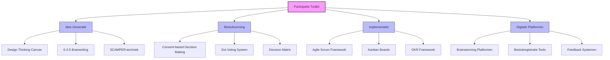

# Hoofdstuk 8: Praktische Tools en Methoden

In dit hoofdstuk ontdek je concrete tools en methoden om medewerkerparticipatie in de praktijk te brengen. We beginnen met het fundament van groepsdynamica en bouwen daarop voort met specifieke instrumenten voor verschillende fasen van het participatieproces.

## Groepsdynamica als fundament voor participatie

Voordat specifieke participatietools effectief kunnen worden ingezet, is het essentieel te investeren in groepsvorming en de relatie met de leidinggevende. Zonder dit fundament zullen zelfs de beste tools weinig effect hebben.

### Ontwikkelingsfasen van teams

Teams doorlopen verschillende ontwikkelingsfasen voordat ze optimaal kunnen functioneren en participeren. Het model van Tuckman onderscheidt vier essentiële fasen:

| Fase | Kenmerken | Geschikte participatietools | Rol van de leidinggevende |
|------|-----------|----------------------------|---------------------------|
| **Forming** Oriëntatiefase | Teamleden leren elkaar kennen, psychologische veiligheid is fragiel | Laagdrempelige kennismakingsactiviteiten, eenvoudige brainstorming | Structuur bieden, verwachtingen verhelderen |
| **Storming** Conflictfase | Verschillen in opvattingen en werkstijlen komen aan de oppervlakte | Tools die verschillende perspectieven zichtbaar maken, gestructureerde discussiemethoden | Constructieve confrontatie faciliteren, verschillen waarderen |
| **Norming** Normeringsfase | Team ontwikkelt gedeelde normen en werkwijzen | Participatiehandvest, besluitvormingsprotocollen | Participatieprincipes verankeren in teamafspraken |
| **Performing** Prestatiefase | Team functioneert als coherent geheel | Geavanceerde participatiemethoden, zelfsturende werkvormen | Faciliteren en coachen, ruimte geven |

**Tip voor leidinggevenden:** Bepaal in welke ontwikkelingsfase je team zich bevindt voordat je participatietools selecteert. Kies tools die passen bij de huidige fase en help het team geleidelijk naar de volgende fase te groeien.

### De rol van psychologische veiligheid

Onderzoek van Amy Edmondson toont aan dat psychologische veiligheid - het gedeelde geloof dat het team veilig is voor interpersoonlijke risico's - de belangrijkste voorspeller is van effectieve teamparticipatie.

**Drie manieren om psychologische veiligheid te versterken:**

1. **Toegankelijkheid modelleren:** Als leidinggevende kun je het voorbeeld geven door:
   - Eigen kwetsbaarheid te tonen en fouten te erkennen
   - Open te staan voor feedback op je eigen functioneren
   - Vragen te stellen in plaats van altijd antwoorden te geven

2. **Nieuwsgierigheid stimuleren:** Creëer een cultuur van nieuwsgierigheid door:
   - Actief vragen te stellen en door te vragen
   - Verschillende perspectieven expliciet te waarderen
   - "Ik weet het niet" te normaliseren als startpunt voor leren

3. **Inclusief leiderschap:** Zorg dat iedereen gehoord wordt door:
   - Actief diverse perspectieven uit te nodigen
   - Dominante stemmen te begrenzen en stillere stemmen ruimte te geven
   - Verschillende communicatiestijlen te accommoderen (schriftelijk/mondeling)

**Tip voor HR-professionals:** Neem vragen over psychologische veiligheid op in medewerkerstevredenheidsonderzoeken. Bijvoorbeeld: "In ons team kunnen mensen problemen en moeilijke kwesties aankaarten" en "In ons team worden fouten gezien als leermogelijkheden".

### Groepscohesie en participatie

De mate van cohesie binnen een team bepaalt in hoge mate de bereidheid tot authentieke participatie. Cohesie ontwikkelt zich langs drie dimensies:

1. **Taakcohesie:** De gedeelde commitment aan teamdoelen en -taken
2. **Sociale cohesie:** De interpersoonlijke aantrekkingskracht tussen teamleden
3. **Waargenomen cohesie:** Het gevoel van eenheid en 'erbij horen'

Participatietools moeten bewust worden geselecteerd om deze drie dimensies te versterken, afhankelijk van de specifieke behoeften van het team in zijn ontwikkelingsfase.

**Praktische cohesieversterkende activiteiten:**
- **Voor taakcohesie:** Gezamenlijke doelstellingssessies, teamcharters, succesviering
- **Voor sociale cohesie:** Informele teamactiviteiten, persoonlijke check-ins, waarderingsrituelen
- **Voor waargenomen cohesie:** Teamidentiteit ontwikkelen (naam, logo), gedeelde taal creëren

## Toolkit voor verschillende fasen van participatie



*Figuur 1: Overzicht van participatietools per fase*

De effectiviteit van medewerkerparticipatie wordt sterk beïnvloed door de keuze en toepassing van de juiste tools en methoden. Een goed ontworpen toolkit:
- Biedt structuur zonder creativiteit te beperken
- Bevordert inclusiviteit zonder efficiëntie te verliezen
- Garandeert transparantie zonder overbelasting

Onderzoek toont aan dat organisaties die doelbewust investeren in participatietools 3,4 keer vaker hun doelstellingen behalen dan organisaties die ad-hoc benaderingen hanteren.

### 1. Idee generatie tools

De eerste fase van elk participatieproces draait om het genereren van diverse, innovatieve ideeën. Effectieve ideegeneratie combineert kwantiteit (veel ideeën) met diversiteit (verschillende perspectieven).

#### Design Thinking Canvas

Deze visuele tool structureert het creatieve proces door deelnemers door vijf fasen te leiden:
1. Empathize: inleven in de gebruiker/stakeholder
2. Define: het probleem helder formuleren
3. Ideate: zoveel mogelijk ideeën genereren
4. Prototype: ideeën tastbaar maken
5. Test: feedback verzamelen en verfijnen

**Wanneer gebruiken:** Bij complexe problemen waar gebruikersperspectief essentieel is.

**Tip voor facilitators:** Zorg voor een goede balans tussen divergeren (breed verkennen) en convergeren (focus aanbrengen). Besteed voldoende tijd aan de empathize-fase om te voorkomen dat oplossingen worden bedacht voor de verkeerde problemen.

#### 6-3-5 Brainwriting Methode

Deze gestructureerde techniek combineert individuele reflectie met collectieve creativiteit:
- 6 deelnemers schrijven elk
- 3 ideeën op in
- 5 minuten

Daarna roteren de bladen en bouwt iedereen voort op de ideeën van anderen. Na vijf rondes zijn er 90 ideeën gegenereerd.

**Wanneer gebruiken:** Wanneer je snel veel ideeën wilt genereren en wilt voorkomen dat enkele dominante stemmen het gesprek bepalen.

**Tip voor HR-professionals:** Deze methode werkt goed in teams waar sommige leden terughoudend zijn om ideeën mondeling te delen. De schriftelijke aanpak geeft iedereen gelijke kans om bij te dragen.

#### SCAMPER-techniek

Deze gerichte ideegeneratietechniek gebruikt zeven denkrichtingen om bestaande concepten te transformeren:
- **S**ubstitueren: Wat kun je vervangen?
- **C**ombineren: Wat kun je samenvoegen?
- **A**anpassen: Wat kun je wijzigen?
- **M**odificeren: Wat kun je vergroten of verkleinen?
- **P**roductief gebruiken voor andere doeleinden: Waar kun je het nog meer voor gebruiken?
- **E**limineren: Wat kun je weglaten?
- **R**eorganiseren: Wat kun je anders ordenen?

**Wanneer gebruiken:** Wanneer je vastloopt in bestaande denkpatronen of bestaande processen/producten wilt verbeteren.

**Praktijkvoorbeeld:** Een HR-afdeling gebruikte SCAMPER om hun beoordelingsproces te vernieuwen. Door systematisch elk element te bevragen Kunnen we jaarlijkse beoordelingen vervangen door continue feedback? Kunnen we zelf-evaluatie combineren met peer feedback?, ontwikkelden ze een innovatief systeem dat beter aansloot bij hun agile werkwijze.

### 2. Besluitvormingstools

Na ideegeneratie volgt de uitdaging om collectief tot beslissingen te komen die zowel kwalitatief sterk als breed gedragen zijn.

#### Consent-based Decision Making (Sociocratie)

In tegenstelling tot consensus (iedereen moet actief instemmen), vereist consent alleen dat er geen overwegend bezwaar is. Een besluit wordt genomen wanneer niemand een beargumenteerd bezwaar heeft dat aantoont dat het voorstel schade zou toebrengen aan het team of de organisatie.

**Wanneer gebruiken:** Bij beslissingen die brede betrokkenheid vereisen maar waar consensus te tijdrovend zou zijn.

**Processtappen:**
1. Voorstel presenteren
2. Verhelderende vragen stellen
3. Reactieronde (eerste indrukken)
4. Aanpassingen aan voorstel
5. Bezwarenronde
6. Integratie van bezwaren
7. Consentronde

**Tip voor leidinggevenden:** Train teams in het onderscheid tussen persoonlijke voorkeuren en beargumenteerde bezwaren. Niet elke aarzeling is een geldig bezwaar in het consent-proces.

#### Dot Voting System

Deze visuele prioriteringstechniek geeft elke deelnemer een beperkt aantal "stemmen" (vaak in de vorm van stickers) die ze kunnen verdelen over verschillende opties. Het resultaat is een visuele heatmap van collectieve voorkeuren.

**Wanneer gebruiken:** Voor snelle prioritering van ideeën of opties in een groep.

**Variaties:**
- Gelijke verdeling: iedereen krijgt evenveel stemmen
- Gewogen verdeling: verschillende rollen krijgen verschillende aantallen stemmen
- Categorische stemming: verschillende kleuren voor verschillende criteria (haalbaarheid, impact, etc.)

**Praktijkvoorbeeld:** Een gemeentelijke organisatie gebruikte dot voting om uit 30 verbetervoorstellen de top 5 te selecteren voor directe implementatie. Door elke afdeling een eigen kleur stickers te geven, werd ook zichtbaar welke voorstellen breed gedragen werden versus welke vooral belangrijk waren voor specifieke afdelingen.

#### Decision Matrix met gewogen criteria

Deze analytische tool helpt teams om opties systematisch te evalueren tegen meerdere criteria, waarbij elk criterium een verschillend gewicht kan krijgen afhankelijk van het belang.

**Wanneer gebruiken:** Bij complexe beslissingen met meerdere opties en verschillende beoordelingscriteria.

**Implementatiestappen:**
1. Definieer de opties die beoordeeld moeten worden
2. Bepaal de beoordelingscriteria (bijv. kosten, impact, haalbaarheid)
3. Ken gewichten toe aan elk criterium (bijv. op schaal 1-5)
4. Score elke optie op elk criterium (bijv. op schaal 1-10)
5. Vermenigvuldig scores met gewichten en tel op voor totaalscore
6. Vergelijk totaalscores om beste optie te bepalen

**Tip voor HR-professionals:** Gebruik deze methode bij het evalueren van verschillende HR-initiatieven of leveranciers. De transparante, systematische aanpak helpt om subjectiviteit te verminderen en maakt de rationale achter beslissingen expliciet.

### 3. Implementatie tools

De waarde van participatie wordt uiteindelijk bepaald door de effectieve implementatie van genomen besluiten. Implementatietools zorgen voor duidelijke verantwoordelijkheden, transparante voortgangsmonitoring, en effectieve coördinatie.

#### Agile Scrum Framework

Dit iteratieve projectmanagementraamwerk verdeelt werk in korte sprints (meestal 2-4 weken), met dagelijkse stand-ups, regelmatige reviews, en retrospectives om continu te leren en aan te passen.

**Wanneer gebruiken:** Bij complexe projecten waar flexibiliteit en snelle aanpassing belangrijk zijn.

**Kernelementen:**
- **Sprint planning:** Team selecteert werk voor de komende sprint
- **Daily stand-up:** Korte dagelijkse check-in (15 min) over voortgang en obstakels
- **Sprint review:** Demonstratie van voltooide werk aan stakeholders
- **Sprint retrospective:** Reflectie op het proces en identificatie van verbeterpunten

**Praktijkvoorbeeld:** Een HR-transformatieteam gebruikte Scrum om een nieuw onboardingprogramma te ontwikkelen. Door het werk op te delen in tweewekelijkse sprints en regelmatig feedback te verzamelen van nieuwe medewerkers, konden ze snel bijsturen en een programma ontwikkelen dat perfect aansloot bij de behoeften.

**Tip voor leidinggevenden:** Begin met een "light" versie van Scrum als je team nog geen ervaring heeft met agile werken. Focus eerst op de dagelijkse stand-ups en korte iteraties voordat je alle ceremonies implementeert.

#### Kanban Boards

Deze visuele managementtool toont werk in verschillende stadia van voltooiing, meestal in kolommen die de workflow representeren (bijv. "Te doen", "In uitvoering", "Voltooid").

**Wanneer gebruiken:** Voor het visualiseren en managen van werkstromen, vooral bij doorlopende processen.

**Kernelementen:**
- **Visualisatie van werk:** Alle taken zijn zichtbaar op het bord
- **Beperking van werk-in-uitvoering (WIP):** Maximumaantal taken per fase
- **Flow management:** Focus op het soepel doorstromen van werk
- **Expliciete procesafspraken:** Duidelijke regels voor hoe werk door het systeem stroomt

**Praktijkvoorbeeld:** Een communicatieteam gebruikte een Kanban-bord om hun contentproductieproces te stroomlijnen. Door WIP-limieten in te stellen, voorkwamen ze overbelasting en konden ze hun doorlooptijd met 40% verkorten.

**Tip voor HR-professionals:** Digitale Kanban-tools zoals Trello of Microsoft Planner zijn laagdrempelig en kunnen teams helpen om snel aan de slag te gaan met visueel werkmanagement.

#### OKR (Objectives and Key Results) Framework

Dit doelstellingsraamwerk verbindt ambitieuze, kwalitatieve doelen (Objectives) met specifieke, meetbare resultaten (Key Results) die succes definiëren.

**Wanneer gebruiken:** Voor het aligneren van teams rond gemeenschappelijke doelen en het creëren van focus en transparantie.

**Kernelementen:**
- **Objectives:** Inspirerende, kwalitatieve doelstellingen
- **Key Results:** 3-5 meetbare resultaten per objective
- **Cascadering:** Organisatiedoelen vertalen naar team- en individuele doelen
- **Regelmatige check-ins:** Wekelijkse of tweewekelijkse voortgangsbesprekingen

**Praktijkvoorbeeld:** Een financiële dienstverlener implementeerde OKRs om hun transformatie naar een meer klantgerichte organisatie te sturen. Door duidelijke, meetbare resultaten te definiëren (zoals "Net Promoter Score verhogen van 15 naar 30"), creëerden ze focus en konden ze vooruitgang transparant maken.

**Tip voor leidinggevenden:** Begin met een beperkt aantal OKRs (1-3 per team) en focus op kwaliteit boven kwantiteit. Zorg dat objectives echt inspirerend zijn en dat key results ambitieus maar haalbaar zijn.

### 4. Digitale platformen

In een toenemend digitale en hybride werkwereld zijn digitale platformen essentieel geworden voor effectieve participatie. Ze overbruggen geografische afstanden, faciliteren asynchrone bijdragen, en creëren permanente repositories van collectieve kennis.

| Type | Tools | Best voor | Tip |
|------|-------|-----------|-----|
| **Brainstorming** | Miro, Mural | Visuele collaboratie | Begin met een duidelijk gestructureerd canvas |
| **Besluitregistratie** | Loomio, DecisionWise | Transparante tracking | Zorg voor duidelijke besluitvormingsprotocollen |
| **Feedback** | Officevibe, Culture Amp | Continue meting | Houd surveys kort en actiegericht |
| **Projectmanagement** | Asana, Monday.com | Complexe trajecten | Integreer met bestaande werktools |

**Tip voor HR-professionals:** Kies platformen die passen bij de digitale volwassenheid van je organisatie. Een te complexe tool kan de participatie juist belemmeren in plaats van faciliteren. Begin met laagdrempelige tools en bouw van daaruit verder.

## Template: Participatiehandvest

Een participatiehandvest is een krachtig instrument om verwachtingen te aligneren, principes te verankeren, en commitment te formaliseren. Het dient als referentiepunt en "grondwet" voor participatieve samenwerking.

```markdown
# Participatiehandvest [Teamnaam]

## Onze Principes
1. Elk idee verdient een eerlijke evaluatie
2. Besluiten worden genomen op basis van gedeelde inzichten
3. Feedback is een geschenk - geef en ontvang het constructief

## Afspraken
- Wekelijkse ideesessies op dinsdag 10-12u
- Maandelijkse besluitreview op laatste vrijdag
- Kwartaarlijkse retrospectives

## Besluitvormingsprotocol
- Informatieve besluiten: [specificeer]
- Consultatieve besluiten: [specificeer]
- Consent-based besluiten: [specificeer]
- Consensus besluiten: [specificeer]

Ondertekend door:
[Naam Leidinggevende] __________________  
[Teamleden] ___________________________
```

**Tip voor leidinggevenden:** Het gezamenlijk ontwikkelen van het handvest is minstens zo waardevol als het eindresultaat. Betrek het hele team bij het opstellen en zorg dat iedereen zich kan vinden in de principes en afspraken.

## Aan de slag: selecteer de juiste tools

> **Reflectievraag:**  
> "Welke tool of methode zou jouw team direct kunnen implementeren om participatie te versterken? Wat is de eerste actie?"

### Praktische tip

Begin met een tool die aansluit bij de huidige ontwikkelingsfase van je team:

- **Voor teams in de forming fase:** Start met laagdrempelige kennismakingsactiviteiten en een eenvoudig participatiehandvest
- **Voor teams in de storming fase:** Implementeer gestructureerde discussiemethoden zoals consent-based decision making
- **Voor teams in de norming fase:** Introduceer visuele werkmanagementtools zoals Kanban boards
- **Voor teams in de performing fase:** Experimenteer met geavanceerde participatiemethoden zoals Open Space Technology

Het gaat niet om de hoeveelheid tools, maar om de juiste tool op het juiste moment. Kies één tool, implementeer deze goed, en bouw van daaruit verder.

[Download toolkit selectiemodel](/hoofdstukken/toolkit-selectiemodel.md){ .md-button .md-button--primary }

### Model voor blijvende verandering

Het volgende model helpt om een blijvende verandering tot stand te brengen:

1.  **Zingeving:** Start het gesprek over wat iedereen drijft en wat de invloed is op:
2.  **Samenwerkingsrelatie:** Wat van invloed is op:
3.  **Bedrijfsprocessen:** Wat van invloed is op:
4.  **Het eindproduct**
