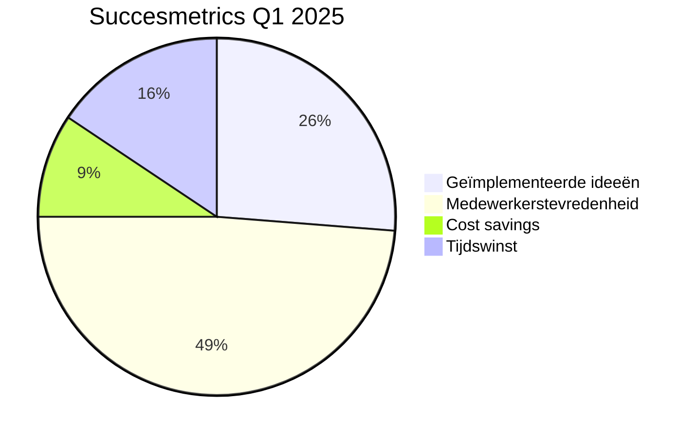

# Hoofdstuk 9: Hoe Meet Je Succes?

## KPI Framework

Het meten van de effectiviteit van medewerkerparticipatie is essentieel voor continue verbetering, het rechtvaardigen van investeringen, en het verankeren van participatieve praktijken in de organisatiecultuur. Zonder robuuste meetmethoden blijft participatie kwetsbaar voor budgetbezuinigingen en managementwisselingen. Onderzoek toont aan dat organisaties die systematisch de impact van participatie meten, significant vaker duurzame participatiepraktijken ontwikkelen dan organisaties zonder formele meetprocessen.

Een effectief KPI (Key Performance Indicator) framework voor participatie combineert kwantitatieve en kwalitatieve metrics, en balanceert tussen proces- en resultaatindicatoren. Het ideale framework is voldoende gestandaardiseerd om vergelijking over tijd mogelijk te maken, maar ook flexibel genoeg om aan te passen aan de specifieke context en doelstellingen van elk participatie-initiatief.

### Kwantitatief

Kwantitatieve metrics bieden objectieve, vergelijkbare data die trends zichtbaar maken en de zakelijke waarde van participatie kunnen onderbouwen. Ze vormen de ruggengraat van elk meetframework.

**Participatiegraad (% deelnemende medewerkers):** Deze basismetric meet het percentage medewerkers dat actief deelneemt aan participatie-initiatieven. Het is een indicator voor de breedte van betrokkenheid en de inclusiviteit van het proces.

Theoretisch kan deze metric worden verfijnd door onderscheid te maken tussen verschillende niveaus van participatie: passief (informatie ontvangen), reactief (feedback geven op voorstellen), actief (bijdragen aan ideegeneratie), en proactief (initiëren van nieuwe participatiemogelijkheden). Een "Participation Depth Index" zou deze niveaus kunnen combineren in een gewogen score die een genuanceerder beeld geeft dan een binaire deelname/niet-deelname metric.

**Implementatiesnelheid (idee → actie):** Deze metric meet de tijd die verstrijkt tussen het genereren van een idee en de daadwerkelijke implementatie. Het is een indicator voor de effectiviteit van het participatieproces en de mate waarin de organisatie in staat is om input om te zetten in concrete actie.

Door de doorlooptijd van ideeën door verschillende fasen van het implementatieproces te monitoren, kunnen knelpunten worden geïdentificeerd waar ideeën vertragen of stranden. Dit maakt gerichte verbeteringen mogelijk in besluitvormings- en implementatieprocessen.

**ROI van participatie-initiatieven:** Deze metric kwantificeert de financiële waarde die wordt gecreëerd door participatie-initiatieven, afgezet tegen de geïnvesteerde resources (tijd, geld, aandacht).

Een gestandaardiseerd ROI-model zou zowel directe als indirecte baten moeten meenemen. Directe baten omvatten kostenbesparingen, omzetgroei, en efficiëntieverbeteringen die direct toe te schrijven zijn aan participatie-initiatieven. Indirecte baten omvatten verminderd personeelsverloop, verhoogde medewerkerstevredenheid, en verbeterde klanttevredenheid, die kunnen worden gekwantificeerd via gevalideerde conversiemodellen.

**Innovatie-impact:** Deze metric meet de bijdrage van participatie aan innovatie, uitgedrukt in metrics zoals het aantal geïmplementeerde innovaties, patentaanvragen, of nieuwe productontwikkelingen die voortkomen uit participatieve processen.

Een goed ontworpen innovatie-index combineert kwantitatieve metrics (aantal geïmplementeerde innovaties, geschatte waarde) met kwalitatieve beoordelingen van de disruptiviteit en strategische alignment van innovaties.

**Kwaliteitsverbetering:** Deze metric meet de impact van participatie op productkwaliteit, servicekwaliteit, of proceskwaliteit, uitgedrukt in indicatoren zoals defectreductie, klanttevredenheid, of first-time-right percentages.

Theoretisch kan een correlatie-analyse de relatie onderzoeken tussen participatiegraad in teams en kwaliteitsmetrics. Longitudinale studies kunnen causale verbanden aantonen tussen de diepte van medewerkerparticipatie in verbeterprocessen en de reductie in kwaliteitsproblemen.

### Kwalitatief

Kwalitatieve metrics vangen aspecten van participatie die niet eenvoudig te kwantificeren zijn, maar essentieel zijn voor het begrijpen van de diepere impact en dynamiek. Ze bieden context en nuance die kwantitatieve data alleen niet kan leveren.

**Medewerkertevredenheid (eNPS):** De employee Net Promoter Score meet de mate waarin medewerkers de organisatie zouden aanbevelen als werkgever, wat een indicator is voor algemene tevredenheid en betrokkenheid. Specifiek voor participatie kan een aangepaste vraag worden gebruikt: "Hoe waarschijnlijk is het dat je collega's zou aanmoedigen om deel te nemen aan participatie-initiatieven?"

Voor een dieper begrip van medewerkertevredenheid in relatie tot participatie is het essentieel om eNPS te combineren met gerichte follow-up vragen die specifiek ingaan op de participatie-ervaring, zoals:

- "In welke mate voel je dat je input serieus wordt genomen?"
- "Hoe heeft participatie je gevoel van eigenaarschap beïnvloed?"
- "In hoeverre voel je je gewaardeerd voor je bijdragen aan participatie-initiatieven?"
- "Hoe heeft participatie je verbondenheid met de organisatie beïnvloed?"
- "In welke mate heeft participatie je professionele ontwikkeling versterkt?"

Deze combinatie van kwantitatieve scores en kwalitatieve inzichten biedt een multidimensionaal beeld van de impact van participatie op medewerkertevredenheid. Door deze metingen regelmatig uit te voeren, kunnen organisaties trends identificeren en gerichte verbeteringen doorvoeren in hun participatiedesign.

**Leiderschapsvertrouwen:** Deze metric meet het vertrouwen dat medewerkers hebben in het leiderschap van de organisatie, met name in de context van participatie. Het reflecteert de perceptie van oprechtheid en commitment aan participatieve principes.

Een "Leadership Trust Barometer" zou specifiek het vertrouwen kunnen meten in de bereidheid van leiders om macht te delen en oprecht open te staan voor input. Door deze metric te koppelen aan leiderschapsontwikkelingsprogramma's, kan een organisatie gericht werken aan het versterken van vertrouwen, wat correlaties kan vertonen met hogere participatiegraden.

**Innovatieklimaat index:** Deze metric evalueert de mate waarin de organisatiecultuur innovatie en creatief denken ondersteunt, wat vaak een indicator is voor de effectiviteit van participatieve praktijken.

Een goed ontworpen "Innovation Climate Survey" meet meerdere dimensies van innovatieklimaat, waaronder psychologische veiligheid, experimenteerruimte, en tolerantie voor risico en falen. Door deze index te tracken voor en na participatie-interventies, kan worden aangetoond hoe goed ontworpen participatieprocessen het innovatieklimaat kunnen verbeteren.

**Narratieve feedback:** Naast gestructureerde metrics is het verzamelen van verhalen en ervaringen van deelnemers essentieel om de menselijke dimensie van participatie te begrijpen en te communiceren.

Een systematische verzameling van narratieve feedback via korte interviews, schriftelijke reflecties, en gefaciliteerde storytelling sessies kan waardevolle inzichten opleveren. Deze verhalen kunnen thematisch worden geanalyseerd om patronen te identificeren en worden gebruikt in interne communicatie om de impact van participatie te illustreren. Deze kwalitatieve data draagt bij aan een dieper begrip van de transformatieve effecten van participatie op individueel niveau.

## Meetinstrumenten en Rijker Verantwoorden

De keuze van de juiste meetinstrumenten is cruciaal voor het verzamelen van betrouwbare, actionable data. Effectieve instrumenten zijn gebruiksvriendelijk, minimaal invasief in werkprocessen, en leveren tijdige inzichten die direct kunnen worden omgezet in verbeteracties.

### Het Principe van Rijker Verantwoorden

Bij het meten van participatiesucces is het essentieel om het principe van "rijker verantwoorden" toe te passen. Dit principe stelt dat effectieve verantwoording altijd meerdere dimensies moet omvatten om een volledig beeld te geven van de waarde en impact. In de context van medewerkerparticipatie betekent dit dat rapportages niet moeten focussen op één enkele metric (zoals ROI of participatiegraad), maar een gebalanceerde set van indicatoren moeten presenteren die verschillende aspecten van succes belichten.

Rijker verantwoorden gaat verder dan alleen cijfers; het omvat ook beelden en verhalen die de context en de menselijke dimensie van participatie belichten. Een voorbeeld hiervan is de metafoor van de "dry highgrounds" en de "muddy lowlands," die de kloof beschrijft tussen de beleidswereld en de operationele realiteit. Beleidsmakers bevinden zich vaak op de "dry highgrounds," waar ze overzicht hebben en abstracte beslissingen nemen, terwijl de mensen in de operatie zich in de "muddy lowlands" bevinden, waar ze dagelijks worstelen met de complexiteit van de uitvoering. Rijker verantwoorden probeert deze kloof te overbruggen door de verhalen en ervaringen van de mensen in de "muddy lowlands" te integreren in de evaluatie van participatie-initiatieven.

Een andere methode om aan integrale evaluatie te doen is "the whole system in a room." Deze methode brengt alle relevante stakeholders samen in één ruimte om gezamenlijk de resultaten en de impact van participatie te evalueren. Door verschillende perspectieven en ervaringen samen te brengen, ontstaat een rijker en genuanceerder beeld van de waarde van participatie.

Een multidimensionaal verantwoordingsmodel voor participatie omvat typisch:

1. **Procesmatige dimensie:** Hoe effectief en inclusief was het participatieproces zelf?
2. **Resultaatdimensie:** Welke concrete uitkomsten en verbeteringen zijn gerealiseerd?
3. **Menselijke dimensie:** Wat was de impact op medewerkerstevredenheid, betrokkenheid en ontwikkeling?
4. **Organisatorische dimensie:** Hoe heeft participatie bijgedragen aan bredere organisatiedoelstellingen en cultuurverandering?
5. **Leerdimensie:** Welke inzichten en capaciteiten zijn ontwikkeld die toekomstige participatie kunnen versterken?

Door deze dimensies te integreren in meetinstrumenten en rapportages, ontstaat een rijker en genuanceerder beeld van participatiesucces dan mogelijk zou zijn met een eendimensionale benadering.

| Meting               | Tool                          | Frequentie     | Dimensie |
|----------------------|-------------------------------|----------------|----------|
| Participatie-engagement | Pulse surveys              | Wekelijks      | Proces   |
| Besluitkwaliteit     | 360° feedback ronde          | Per project    | Resultaat|
| Economisch effect     | Cost-benefit analyse         | Kwartaal       | Resultaat|
| Medewerkerstevredenheid | eNPS + diepte-interviews   | Maandelijks    | Menselijk|
| Cultuurimpact        | Cultural assessment          | Halfjaarlijks  | Organisatie|
| Leereffect           | Competentie-mapping          | Kwartaal       | Leren    |

### Meetinstrumenten voor Medewerkerstevredenheid

Gezien het belang van medewerkerstevredenheid als indicator voor participatiesucces, verdienen de meetinstrumenten hiervoor speciale aandacht:

**Gestructureerde Tevredenheidsmetingen:**
- **eNPS (Employee Net Promoter Score):** Een kwantitatieve baseline-meting die eenvoudig te implementeren en te tracken is over tijd.
- **Participatie-specifieke Tevredenheidssurveys:** Gedetailleerde vragenlijsten die dieper ingaan op verschillende aspecten van de participatie-ervaring.
- **Pulse Checks:** Ultrakorte, frequente metingen (1-2 vragen) die trends in medewerkerssentiment kunnen identificeren zonder survey-vermoeidheid te veroorzaken.

**Kwalitatieve Instrumenten:**
- **Semi-gestructureerde Interviews:** Diepgaande gesprekken met een representatieve steekproef van medewerkers om rijke, contextuele inzichten te verzamelen.
- **Focus Groepen:** Gefaciliteerde groepsdiscussies die collectieve perspectieven en gedeelde ervaringen kunnen onthullen.
- **Reflectiejournals:** Gestructureerde zelfreflectie door deelnemers over hun participatie-ervaring en de impact op hun werkbeleving.

**Observationele Methoden:**
- **Participatieve Observatie:** Getrainde observatoren die participatieprocessen bijwonen en interactiepatronen, engagement-niveaus, en non-verbale signalen documenteren.
- **Gedragsanalyse:** Monitoring van objectieve gedragsindicatoren zoals vrijwillige deelname aan vervolginitiatieven, kennisdeling, of peer-to-peer ondersteuning.

Door deze instrumenten te combineren in een geïntegreerd meetprogramma, kunnen organisaties een genuanceerd begrip ontwikkelen van hoe participatie de medewerkerstevredenheid beïnvloedt, en welke specifieke aspecten van het participatieproces de grootste impact hebben.

### Meetinstrumenten voor Eindresultaten

Naast medewerkerstevredenheid is het meten van concrete eindresultaten essentieel voor het rechtvaardigen van investeringen in participatie:

**Kwantitatieve Resultaatmetingen:**
- **ROI-analyse:** Systematische berekening van de financiële returns op participatie-investeringen, inclusief zowel directe als indirecte baten.
- **Implementatie-metrics:** Tracking van het percentage geïmplementeerde ideeën, implementatiesnelheid, en de duurzaamheid van implementaties over tijd.
- **Performance-indicatoren:** Meting van specifieke KPIs die direct beïnvloed worden door participatie-initiatieven, zoals productiviteit, kwaliteit, of klanttevredenheid.

**Kwalitatieve Resultaatbeoordelingen:**
- **Impact Narratives:** Gestructureerde documentatie van significante verbeteringen of innovaties die zijn voortgekomen uit participatie, inclusief de bredere impact op de organisatie.
- **Stakeholder Assessments:** Evaluaties door diverse belanghebbenden (niet alleen deelnemers) van de waarde en impact van participatieresultaten.
- **Longitudinale Case Studies:** Diepgaande analyses van specifieke participatie-initiatieven over langere tijd om de volledige impact te documenteren.

Door zowel kwantitatieve als kwalitatieve resultaatmetingen te integreren, kunnen organisaties een compleet beeld krijgen van de waarde die wordt gecreëerd door participatie, van directe financiële returns tot bredere organisatorische verbeteringen.

## Multidimensionale Dashboards

Een effectief participatiedashboard visualiseert key metrics op een manier die zowel strategisch overzicht als operationele details biedt. Het maakt trends zichtbaar, faciliteert vergelijking, en stimuleert data-gedreven besluitvorming over participatie-initiatieven. In lijn met het principe van rijker verantwoorden, is een effectief dashboard altijd multidimensionaal.

### Theoretisch Kader voor Dashboardontwerp

Een goed ontworpen participatiedashboard is gebaseerd op de volgende principes:

1. **Multidimensionaliteit:** Het dashboard integreert metrics uit verschillende dimensies (proces, resultaat, menselijk, organisatorisch, leren) om een holistisch beeld te geven.

2. **Gelaagdheid:** Het dashboard biedt zowel high-level overzichten als mogelijkheden om in te zoomen op specifieke details, afhankelijk van de behoeften van verschillende stakeholders.

3. **Contextualisering:** Metrics worden gepresenteerd in context, met relevante benchmarks, targets, en historische trends om betekenisvolle interpretatie mogelijk te maken.

4. **Actionability:** Het dashboard is ontworpen om niet alleen te informeren maar ook actie te stimuleren, met duidelijke indicaties van waar interventie nodig is.

5. **Toegankelijkheid:** De visualisaties zijn intuïtief en begrijpelijk voor verschillende stakeholders, ongeacht hun data-geletterdheid.

### Visualisatie van Multidimensionale Data

Dit voorbeeld toont een high-level overzicht van participatieresultaten voor Q1 2025, met focus op vier kernmetrics die verschillende dimensies vertegenwoordigen: proceseffectiviteit (geïmplementeerde ideeën), menselijke impact (medewerkerstevredenheid), en resultaatdimensies (cost savings en tijdswinst).

Een volledig multidimensionaal dashboard zou echter meer gelaagd zijn, met verschillende views voor verschillende stakeholders:

**Strategische View** toont high-level metrics zoals totale ROI, participatiegraad, en strategische alignment van initiatieven. Het visualiseert trends over tijd en vergelijkt prestaties tegen targets en benchmarks.

**Operationele View** focust op procesmetrics zoals implementatiesnelheid, besluitkwaliteit, en teamengagement. Het biedt actionable insights voor het verbeteren van participatieprocessen en het adresseren van knelpunten.

**Medewerker View** geeft individuele medewerkers inzicht in hun eigen participatiepatronen, de impact van hun bijdragen, en mogelijkheden voor verdere betrokkenheid. Deze transparantie versterkt eigenaarschap en motivatie.

### Integratie van Data en Inzichten

Een geavanceerd participatiedashboard wordt gevoed door automatische data-integratie vanuit verschillende bronnen, waaronder:

- Participatieplatforms en tools
- HR-systemen en medewerkerstevredenheidsmetingen
- Projectmanagement- en implementatietools
- Financiële systemen voor ROI-berekeningen
- Kwaliteits- en performancemanagementsystemen

Moderne dashboards maken gebruik van data-analyse technieken om correlaties en patronen te identificeren die menselijke analisten mogelijk zouden missen, zoals:

- De relatie tussen participatiefrequentie en innovatie-output
- De optimale teamgrootte voor verschillende typen participatie-initiatieven
- Voorspellende indicatoren voor succesvolle implementatie
- Factoren die medewerkerstevredenheid met participatieprocessen het sterkst beïnvloeden

Door deze geavanceerde analyses te integreren in toegankelijke visualisaties, stellen multidimensionale dashboards organisaties in staat om datagedreven beslissingen te nemen over hun participatieprocessen, wat leidt tot continue verbetering en optimalisatie.

## Meetuitdagingen en Oplossingen

Het meten van participatiesucces brengt specifieke uitdagingen met zich mee die bewuste strategieën vereisen om te adresseren.

### Uitdaging 1: Attributie

Een fundamentele uitdaging is het isoleren van de impact van participatie van andere factoren die resultaten beïnvloeden. Hoe weet je zeker dat verbeteringen toe te schrijven zijn aan participatie en niet aan andere variabelen?

**Oplossing: Quasi-experimentele designs**

Een theoretisch onderbouwde aanpak is het implementeren van quasi-experimentele designs waarbij sommige afdelingen participatieve methoden implementeren terwijl vergelijkbare afdelingen dat niet doen, wat een vorm van controlegroep creëert. Door resultaten te vergelijken tussen deze groepen, kan de specifieke impact van participatie beter worden geïsoleerd. Onderzoek toont aan dat afdelingen met hoge participatiescores significant meer procesverbeteringen realiseren dan vergelijkbare afdelingen met lage scores, na controle voor andere variabelen.

Een andere effectieve strategie is het gebruik van tijdreeksanalyse, waarbij metrics worden gemeten voor, tijdens en na participatie-interventies. Longitudinale studies kunnen duidelijke "knikpunten" in performance metrics identificeren die samenvallen met de introductie van participatieve praktijken, wat sterke indicaties geeft van causale relaties.

### Uitdaging 2: Zachte Factoren Kwantificeren

Veel waardevolle outcomes van participatie zijn "zacht" en moeilijk te kwantificeren, zoals verbeterde samenwerking, verhoogd vertrouwen, of dieper eigenaarschap.

**Oplossing: Mixed-methods benadering**

Een theoretisch robuuste benadering combineert kwantitatieve metrics met kwalitatieve methoden zoals narratieve analyse, observatiestudies, en diepte-interviews. Een goed ontworpen "Participation Impact Framework" gebruikt gevalideerde schalen om zachte factoren te meten, aangevuld met rijke kwalitatieve data die context en nuance biedt. Deze mixed-methods benadering leidt tot een meer holistische waardering van participatie-impact, inclusief onverwachte positieve effecten zoals verbeterde cross-functionele relaties en spontane kennisdeling die niet zichtbaar zijn in puur kwantitatieve analyses.

Een innovatieve aanpak is het gebruik van "proxy metrics" - meetbare indicatoren die correleren met moeilijk kwantificeerbare factoren. Voorbeelden hiervan zijn "vrijwillige overuren" als proxy voor intrinsieke motivatie en "cross-departementale communicatiefrequentie" als proxy voor samenwerkingskwaliteit.

### Uitdaging 3: Meetvermoeidheid

Frequente metingen kunnen leiden tot survey-vermoeidheid en dalende responsratio's, wat de kwaliteit en representativiteit van data ondermijnt.

**Oplossing: Embedded measurement**

Een theoretisch onderbouwde oplossing is "embedded measurement" waarbij dataverzameling wordt geïntegreerd in natuurlijke werkprocessen in plaats van als separate activiteit. Een digitaal participatieplatform kan automatisch metrics verzamelen zoals deelnamefrequentie, bijdragepatronen, en implementatievoortgang als onderdeel van het normale gebruik. Dit kan worden aangevuld met micro-surveys van slechts 1-2 vragen die roteren tussen gebruikers, zodat geen enkele gebruiker overbelast wordt maar collectief toch comprehensive data wordt verzameld. Onderzoek toont aan dat deze aanpak kan leiden tot responsratio's van meer dan 80%, vergeleken met 30-40% voor traditionele surveys.

Een complementaire strategie is het gebruik van "pulse" metingen - ultrakorte, frequente check-ins die minimale tijd vereisen. Een dagelijkse pulse kan medewerkers één vraag per dag stellen, die in minder dan 10 seconden kan worden beantwoord via een mobiele app. De hoge frequentie maakt het mogelijk om subtiele veranderingen in sentiment en ervaring te detecteren die kwartaal- of jaarlijkse metingen zouden missen.

## Theoretisch Model: Implementatieversnelling

Een theoretisch model voor het verbeteren van participatie-effectiviteit richt zich op de implementatiesnelheid van verbeterinitiatieven. Dit model biedt waardevolle inzichten voor organisaties die worstelen met lange doorlooptijden van idee tot implementatie.

**Uitdaging:**
Veel organisaties hebben een traditie van medewerkersbetrokkenheid bij verbeterinitiatieven, maar worstelen met de implementatiesnelheid. Ideeën doorlopen vaak een langdurig beoordelings- en goedkeuringsproces, wat leidt tot frustratie bij medewerkers en gemiste kansen voor operationele verbetering. In typische gevallen kan de gemiddelde tijd van idee tot implementatie oplopen tot 120 dagen of meer, wat betekent dat sommige voorstellen al verouderd zijn tegen de tijd dat ze worden geïmplementeerd.

**Theoretisch kader:**
Een effectieve aanpak focust op één primaire metric: implementatietijd van verbeterinitiatieven. Deze keuze is strategisch - door te focussen op één duidelijke, meetbare indicator kunnen organisaties gerichte verbeteringen doorvoeren en duidelijke resultaten demonstreren.

Een drieledige meetstrategie is optimaal:

1. **Baseline assessment:** Een grondige analyse van historische data identificeert de gemiddelde implementatietijd en breekt deze op in verschillende fasen: ideegeneratie, initiële review, diepte-analyse, goedkeuring, en implementatie. Deze analyse onthult waar de grootste bottlenecks zich bevinden in het proces.

2. **Process metrics:** Specifieke metrics voor elke fase van het proces, zoals "first response time" (tijd tot eerste feedback op een idee), "decision velocity" (aantal beslissingen per week), en "implementation completion rate" (percentage van geplande implementatiestappen voltooid op tijd) geven inzicht in specifieke verbeterpunten.

3. **Outcome metrics:** Naast de primaire metric (totale implementatietijd) zijn secundaire outcomes zoals medewerkerstevredenheid met het proces, percentage geïmplementeerde ideeën dat de beoogde resultaten behaalt, en ROI van verbeterinitiatieven essentieel voor een multidimensionaal beeld van succes.

**Theoretische interventies:**
Op basis van de meetresultaten kunnen gerichte interventies worden geïmplementeerd:

1. **Visuele management systemen:** Dashboards die real-time de status en voortgang van alle verbeterinitiatieven tonen creëren transparantie en een gezonde druk op besluitvormers en implementatieteams om voortgang te boeken.

2. **Gedecentraliseerde besluitvorming:** Herstructurering van het goedkeuringsproces, waarbij teams autonomie krijgen om initiatieven onder een bepaalde investerings- of impactdrempel zelf goed te keuren. Alleen initiatieven boven deze drempels vereisen senior management goedkeuring.

3. **Agile implementatiemethodologie:** Een sprint-gebaseerde benadering voor implementatie, met korte cycli en regelmatige stand-ups om obstakels snel te identificeren en adresseren versnelt het proces aanzienlijk.

4. **Erkenningssystemen:** Formele vieringen voor succesvolle implementaties, waarbij zowel de ideegeneratoren als de implementatieteams worden erkend, versterken de gewenste cultuur. Deze rituelen kunnen worden gekoppeld aan dashboards, met automatische notificaties wanneer een initiatief volledig is geïmplementeerd.

**Theoretische impact:**
De impact van deze metric-gedreven aanpak kan substantieel zijn:

- **Implementatietijd:** Reducties van 50-70% zijn theoretisch haalbaar
- **Medewerkerstevredenheid:** Significante stijgingen in tevredenheid met het verbeterproces
- **Implementatiesucces:** Hogere slagingspercentages van geïmplementeerde ideeën
- **Economische impact:** Substantiële kostenbesparingen en efficiëntieverbeteringen

Wat dit theoretische model bijzonder waardevol maakt, is hoe de focus op één primaire metric (implementatietijd) als katalysator kan fungeren voor bredere verbeteringen in het participatieproces. Door deze metric centraal te stellen in communicatie, dashboards, en management reviews, kan organisatiebrede alignment en urgentie worden gecreëerd rond het versnellen van implementatie.

Een theoretisch voorspelbaar neveneffect is dat verhoogde implementatiesnelheid leidt tot een significante stijging in het aantal ingediende ideeën. Medewerkers die zien dat hun suggesties snel worden geïmplementeerd, zijn gemotiveerd om meer ideeën in te dienen, wat leidt tot een positieve feedback loop van verhoogde participatie en versnelde verbetering.

Vanuit theoretisch perspectief functioneert de metriek niet alleen als meetinstrument, maar als een krachtig signaal over wat de organisatie waardeert. Door implementatiesnelheid te meten en te vieren, communiceert de organisatie dat actie en resultaat worden gewaardeerd boven perfectie en uitgebreide analyse.

## Evolutie van Meetpraktijken: Theoretisch Model

Effectieve meetpraktijken evolueren mee met de volwassenheid van participatie in de organisatie. Wat werkt in de beginfase verschilt van wat nodig is in meer mature stadia. Een theoretisch model voor deze evolutie omvat drie fasen:

### Fase 1: Baseline Metrics (0-6 maanden)

In de beginfase is het essentieel om een nulmeting te etableren en eenvoudige, directe metrics te implementeren die vroege successen kunnen aantonen.

Theoretisch gezien zijn de meest effectieve startmetrics:
- **Participatiegraad:** Percentage deelnemende medewerkers
- **Implementatieratio:** Percentage ideeën dat wordt geïmplementeerd
- **Deelnemerstevredenheid:** Algemene tevredenheid met het participatieproces

Deze eenvoudige metrics zijn gemakkelijk te verzamelen en te communiceren, en bieden snelle validatie van de waarde van participatie. Positieve vroege resultaten creëren momentum voor verdere investering en expansie.

### Fase 2: Verfijnde Metrics (6-18 maanden)

Naarmate participatie evolueert, worden metrics theoretisch gezien verfijnder en meer gedifferentieerd om dieper inzicht te bieden in verschillende aspecten van het proces.

In deze fase evolueert het meetsysteem van algemene tevredenheidsscores naar specifieke metrics voor verschillende fasen van het participatieproces, zoals:
- **Ideation effectiveness:** Kwaliteit en diversiteit van gegenereerde ideeën
- **Decision inclusivity:** Mate waarin diverse perspectieven worden meegenomen in besluitvorming
- **Implementation fidelity:** Mate waarin implementatie de oorspronkelijke intentie van het idee behoudt

Deze granulaire metrics helpen om specifieke verbeterpunten te identificeren en gerichte interventies te ontwikkelen.

### Fase 3: Systemische Metrics (18+ maanden)

In mature stadia verschuift de focus theoretisch naar systemische impact en de integratie van participatie in bredere organisatieprocessen en -cultuur.

Een mature meetframework integreert participatiemetrics met bredere organisatie-indicatoren zoals:
- **Innovatiecapaciteit:** Vermogen om nieuwe ideeën te genereren en implementeren
- **Organisatieleren:** Snelheid en effectiviteit waarmee de organisatie zich aanpast
- **Adaptief vermogen:** Flexibiliteit en responsiviteit op veranderende omstandigheden

Een theoretische "Participative Organization Index" zou metrics uit verschillende domeinen combineren om te evalueren hoe participatie bijdraagt aan de algehele organisatieperformance en -veerkracht. Deze holistische benadering kan leiden tot strategische beslissingen om participatie te integreren in kernprocessen zoals strategieontwikkeling, talentmanagement, en kapitaalallocatie.

## Reflectievraag

> "Welke drie metrics zouden voor jouw organisatie het meest betekenisvol zijn om participatiesucces te meten?"

Deze reflectievraag nodigt uit tot een contextuele benadering van participatiemeting. Door te vragen naar specifiek drie metrics, stimuleert de vraag prioritering en focus, in plaats van een uitputtende maar onpraktische lijst. Onderzoek naar performance management toont aan dat organisaties die focussen op een beperkte set "North Star" metrics 2,7 keer effectiever zijn in het realiseren van strategische doelstellingen dan organisaties die proberen alles te meten.

De vraag erkent impliciet dat de meest waardevolle metrics verschillen per organisatie, afhankelijk van factoren zoals:

- De primaire doelstellingen van participatie (innovatie, efficiëntie, medewerkerstevredenheid, etc.)
- De huidige organisatiecultuur en -volwassenheid
- De specifieke uitdagingen en pijnpunten in bestaande processen
- De beschikbare meetcapaciteit en -infrastructuur

Voor sommige organisaties kunnen procesmetrics zoals participatiegraad of implementatiesnelheid het meest waardevol zijn, vooral als ze worstelen met inclusiviteit of executie. Voor andere organisaties kunnen resultaatmetrics zoals innovatie-impact of kostenbesparingen overtuigender zijn, met name als ze de zakelijke waarde van participatie moeten rechtvaardigen. En voor organisaties in transformatie kunnen cultuurmetrics zoals psychologische veiligheid of leiderschapsvertrouwen essentiële indicatoren zijn van diepere verandering.

Door deze reflectie te koppelen aan de specifieke context van de eigen organisatie, wordt de theoretische kennis over participatiemeting vertaald naar praktische, actionable inzichten die direct kunnen bijdragen aan effectievere participatie-initiatieven.

[Download metrics selection toolkit](/hoofdstukken/metrics-selection-toolkit.md){ .md-button .md-button--primary }
